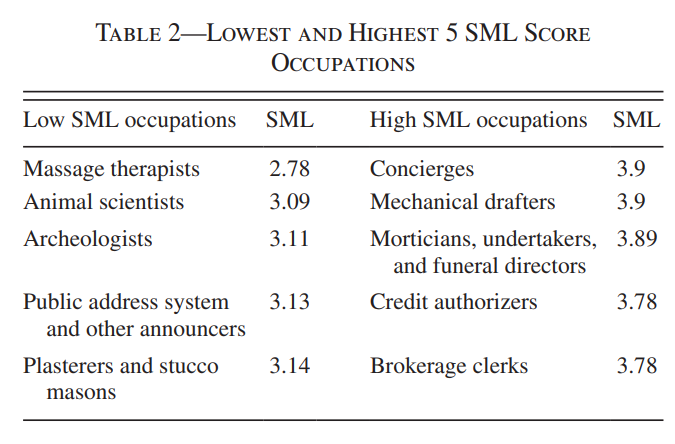
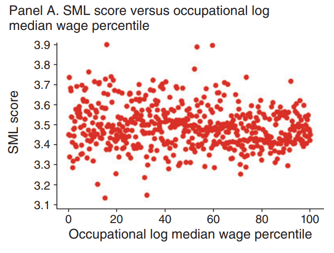
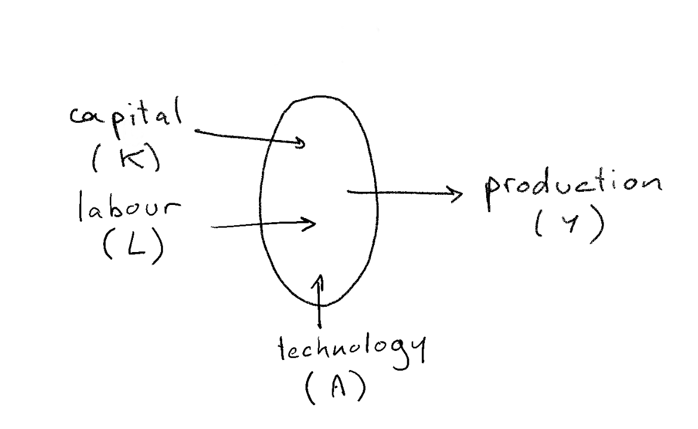
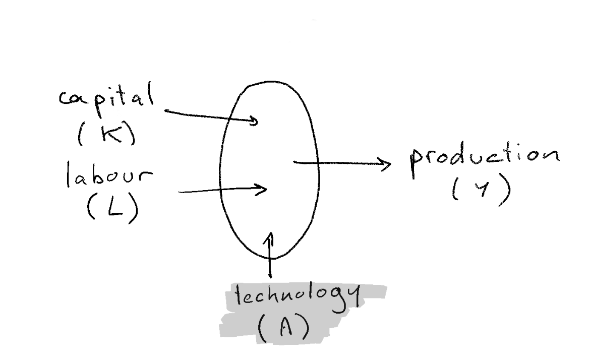
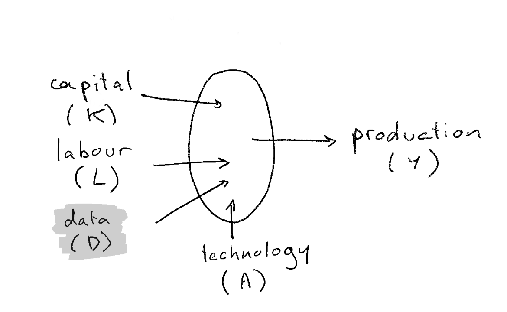
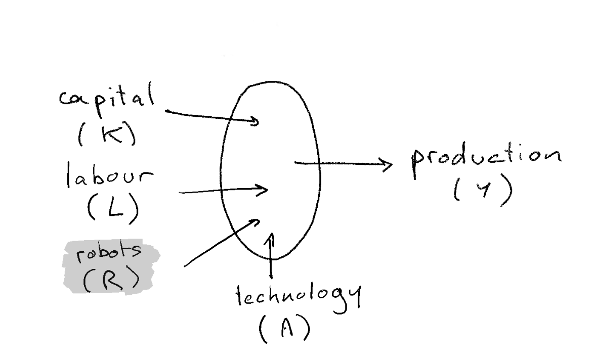
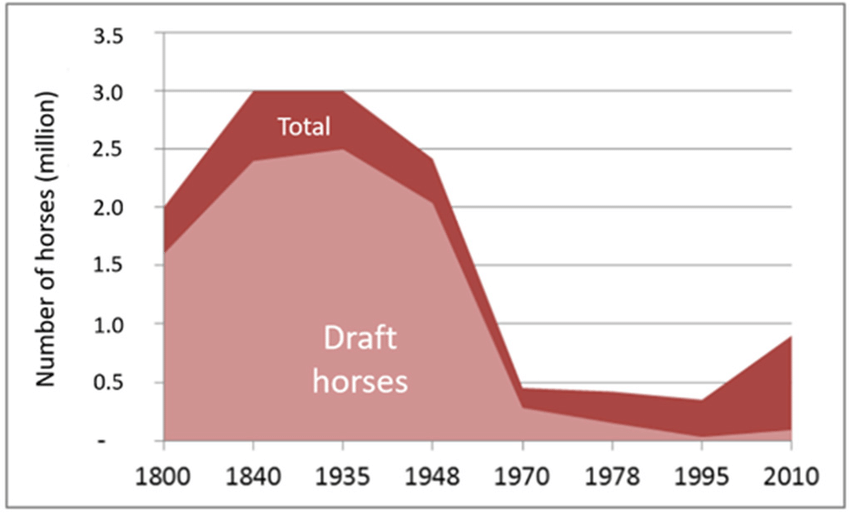

---

<strong>The Inherent Error in Value in Big Companies</strong>

Value is a curve, not a line.

Big companies have both strong positive momentum and strong negative momentum that investors underestimate.

Most investors miss this because they're comparing big company performance against venture stage companies.

It's no wonder big companies have had such great outperformance when they're being valued on metrics more relevant for an early stage company than a large one.

To value a big company, you need to understand how its business will be disrupted, not only by new competitors, but by faster versions of itself. Because at big companies, the biggest risk is the competition you already know.

Generative Pre-trained Transformer 3 (GPT-3)

----

<strong>Legal clause:</strong> Upon liquidation of the Company, the Series A Shareholders will receive in preference to all other shareholders an amount in respect of each Series A Share equal to one times the original Issue Price (the "Liquidation Preference"), plus all accrued but unpaid dividends. To the extent that the Company has assets remaining after the distribution of that amount, the Series A Shareholders will participate with the holders of Ordinary Shares pro rata the number of shares held on an as converted basis.

<strong>Plain English: </strong>If the startup is wound up, the Series A investors will be paid back at least what they invested and they will also share any leftover assets with ordinary shareholders.

Generative Pre-trained Transformer 3 (GPT-3)

----

### GPT-3

- GPT-3: Generative Pre-trained Transformer
  - by OpenAI (now Microsoft
  - big deep-learning architecture, trained billions of texts
  - a language model
- 

- <!-- .element: class="fragment" --> GPT-3 was trained to translate from legal into plain english, by looking at just <strong>two</strong> examples !!!!
-  <!-- .element: class="fragment" --> can do many other things:
  - write progams
  - produce financial statements
  - generate tweets

----

- Science Fiction has explored many problems associated with AI. 
- Very often economic future is bleak...

---

# Rise of Artificial Intelligence

## Can we (economists) do more than Science Fiction?

### Pablo Winant

---

## What is AI?

----

### What is AI

- AI can be:
  - a field
  - a set of technologies including
    - machine learning
    - deep learning
    - reinforcement learning
  - a philosophical concept
- Artificial intelligence: usual definition
  - mimic human intelligence: 
    - problem solving: achieve goal without being explicitly told how
    - learning: gets better over time
  - without emotions

----

### How to make the difference between a robot and a ?

- Check whether it thinks like a human being
- Turing test:
  - a machine discussing with a human must be recognized as a human 50% of the time
  - can machines emulate human behaviour?
- Chinese Room thought experiment
  - how to differentiate somebody who speaks chinese and somebody who follows rules to speak?
  - turing test cannot determine whether machines think

----

### Impress me?

- So, what can machines do that is really intelligent?
  - speech recognition, language translation
  - drive a car
  - play chess better than a man
  - play go, better than a man, without being a specialist, by learning on its own
  - [create](https://thispersondoesnotexist.com/), [imagine](http://www.yaronhadad.com/deep-learning-most-amazing-applications/)
  - have [empathy](https://replika.ai/)

----

### AI effect

- people have a way to discount achievments of AI as "not AI"
  - because not impressive enough
  - because humans do it in "a different way"
- Larry Tesler theorem: "AI is whatever hasn't been done yet"
- Nick Bostrom: "once something becomes useful enough and common enough it's not labeled AI anymore"
- keep human special
  - interestingly that didn't seem to be a concern before the 70s

----

### What does the machine do?

- fit a model to represent the data (learn)
- extrapolate to make a prediction
- like a linear regression?
  - yes, but with more complicated model
  - machine learning has many of them
  - deep learning is now

----

### How does it do it ?

- in the 50s: Rosenblatt: first artificial neuron
- nowadays: neural networks
  - thousands/millions of neurons
  - trained on efficient hardware
- artificial neural network have nothing to do with the brain anymore

- neural network adjusts in order to maximize "some objective"
  - ex: GPT-3 175 billion parameters trained on 45 TB of Data

----

### Weak AI / Strong AI
  
- Weak AI 
  - specific task (recognize images, interpolate data, drive car)
  - human specify objectives, training hyperparameters
- Strong AI:
  - general-purpose
  - sets it own goal...
  - ...evolve over time
  - at least as strong as humans
    - turing test
    - CRA
  - would still have to learn
- Singularity: AI is developped with research made by AI

----

### Prepare yourself for surprises

- Don't be naive: AI might have intrinsic limits...
  - ... but we are repeatedly proven wrong
  - ... if they exist we don't know what they are

- Von Neuman: "You insist that there is something a machine cannot do. If you will tell me *precisely* what it is that a machine cannot do, then I can always make a machine which will do just that!"

- In the long run, we should think about AI in a way that is not too specific to its current nature

---

## The Future of Work. Now.

----

### Who is going to be replaced?

*What Can Machines Learn and What Does It Mean for Occupations and the Economy?* Erik Brynjolfsson, Tom Mitchell, and Daniel Rock

- Rise of automation was detrimental middle jobs. Same here?
  - AI technology is potentially very pervasive because it doesn't require much formalism
  - Polanyi's paradox: we know more than we can tell

- Consider technology available today: Machine Learning (including DL)
- Is it susceptible to replace workers ? is your work at risk ?
- Paper considers only displacement feasibility

----

### Who is going to be replaced? (2)

- An occupation is a bundle of tasks
  - tries to find which tasks are susceptible to machine learning (SML)

- from O*NET database (occupational information)
  - 964 *occupations*
  - decomposed 18,156 *tasks*
  - made of 2,069 work activities
    - ex: sort information, show empathy

- Crowdflower: evaluate work activities by answering
  - 23 distinct statements to be evaluated on a 5-point scale varying from “strongly disagree” to “strongly agree.”
  - example: is repetitive, requires data, requires physical action

----

### Who is going to be replaced? (3) Results

Almost no
- fully replaceable occupation
- fully ML immune occupation

----

### Who is going to be replaced? (3) Results

- everybody is at risk
- very different from effect of automation in the 90s
  - polarization effect on the work force: disappearance of intermediary jobs
  - effect *might* work in reverse

---

## "This Time it's Different" or "Same old, same old"

----

----

### Reminder: the Neoclassical View of Production

- production takes several factors as inputs
- marginal returns w.r.t. each factor are *decreasing*
- factors are paid according to their marginal productivity
- the precise description depends on the problem under consideration
- what would you change to take into account the effect of AI?
  - data, technological change ? 

----

### Three hypotheses about the economic nature of AI

1. Another Technological Advance
   1. prediction technology
   2. data
2. Another Technological Advance, Just, More Extreme
   1. a competitor for humans
3. Something else Completely

These views complement each other

---

## AI is a change in the cost structure

----

----

### AI is a change in the cost structure

Avi Goldfarb: *Prediction Machines: The Simple Economics of Artificial Intelligence* 2018

- suprise: many problems can be formulated as prediction problems
  - when the cost of something decrease you want more of it (law of demand)
- production adjust to minimize cost of production
- AI is a decrease in the __cost__ of predictions
  - Value of all tasks/jobs complementary with predictions will rise
  - Salary of other tasks will fall
- Adjustment is key

----

### Another implication of the same thinking:

- today Deep Learning consumes a lot of energy
- GPT-3 training produces CO2 equivalent equivalent to 126 danish homes
  - 50 petaflop/s-days  (laptop << 1000 teraflops/s : 50000 days for a regular laptop)
- seems crazy, right ?
    - or, is it ? what other process does the same in a more efficient way ?
- is such a technology is unethical?
  - DL technology has been developped with cheap energy / cheap carbon emissions
    - algorithmically very inefficient (bruteforce)
    - *lots* of useless operations (lots tries and errors due to bad priors)
  - lots of inefficiency can be remedied
    - ex: deep learning chess programs on smartphones

---

## AI is Data

----

----

## AI: adds data to the production function

Chad Jones and Christopher Tonetti (Stanford) (Sep 2020, American Economic Review)

- Data is a factor, not a technology
  - idea: use machine learnig to build self driving cars
  - factor: each car-maker gathering is own data
- Data improves quality of product (even if anonymous)
- A nonrival good: can be used with leftovers
  - but excludable: club goods
- Nonrival implies *increasing returns to scale*:
  - marginal value of new data increases more than proportionnally

----

### AI: adds data to the production function (consequences)

- increasing returns to scale implies (natural) monopoly
  - GAFAMs
  - increasing suboptimal monopoly rents (already a problem before existence of AI...)
  - at this stage not clear what is the barrier to entry: data-gathering or data-processing
- what kind of good is data 
  - where are the markets? (empirically it seems "undertraded")
  - who owns the data ? Consumer, producer.
- solutions:
  - split the monopolies (if deadweight loss is too big)
  - outlaw data gathering (big productivity loss)
  - force data-sharing: make it a public good
  - let the consumer be free to decide whether to rent his data

---

## Rise of the Robots

----

----

### Economic singularity

- What about the very long run?

- Recall the neoclassical world
  - market economy
  - technological progress reduces production cost
  - always good for consumers. Increase (real) total income.
  - becomes an inequality problem

- __But__:
  - whether it reduces salaries depends on whether growth is labour augmenting or capital augmenting
  - if AI is a close enough substitute, salaries of "humans" as a whole are at risk
  - the is an economic *singularity* when salary of humans arrives below the subsistance level

- Two sets of authors reach very similar conclusions
  - Anton Korinek and Joseph Stiglitz: more complete/technical
  - Gilles Saint Paul: more political economy

----

### Scenarios

- Analysis taken from Gilles Saint Paul

- Hypothesis: all humans can be replaced by more productive robots

- Comparative advantage logic: humans specialize in work where their comparative disadvantage is lowest (services, art, crafting...)

----

### Scenario 1: society redistributes income from robots

Four political subscenarios

1. welfare state
  - robot-owners are taxed, income is redistributed
   - for instance as universal income
  - some productivity loss
  - what about international competition?
2. rentiers society
  - robot owners invest the rent over many generations. capital concentration increases
3. neo fordism
  - Firms pay huge salaries for essentially useless jobs (powerpoint presentations, ...)
  - Useful to sustain demand
4. roman empire
  - robot owners: __patricians__ (top 2%)
  - rest of population: __plebeians__
    - survive thanks to clientelism
  - robots: slaves

----

### Scenario 2: wars, starvation, epidemic

  - human income falls below subsistance levels
  - malthusian effect: population growth decreases
  - not unheard of (Leontieff): consider population of draft horses

----

### Scenario 3: the Matrix

- human wage decrease
- subsistance level decrease dramatically too

<!-- Carbon emissions decreased by 26% during CoVid -->

---

## Something Else Completely?

- Right now AI is a technology
- What if it becomes another intelligent agent?
  - has its own goals
  - its own preferences
  - with superhuman thinking abilities...
- Response:
  - Anton Korinek: if market economy survives
    - malthusian and non-malthusian scenarios
  - At that stage humans might be something different completely
    - transhumanism

---

## Conclusion

- Research on AI is very speculative: especially about the long run
- But traditionnal economics still help
- How to think of AI as a new kind of intelligent beings?
  - hard to do it scientifically
  - imagine
  - play games

---

## More Readings

- Chad Jones and Christopher Tonetti: *Nonrivalry and the Economics of Data*, American Economic Review

- Avi GoldFarb: *Prediction Machines: The Simple Economics of Artificial Intelligence* 2018

- Brynjolfsson, Tom Mitchell, and Daniel Rock: *What Can Machines Learn and What Does It Mean for Occupations and the Economy?*, American Economic Review P&P

- Gilles Saint Paul: *Robots Vers la fin du travail ?*

- Anton Korinek, Joseph E. Stiglitz: *Artificial Intelligence and Its Implications for Income Distribution and Unemployment*, chapter in *Artificial Intelligence and Its Implications ..., NBER*
