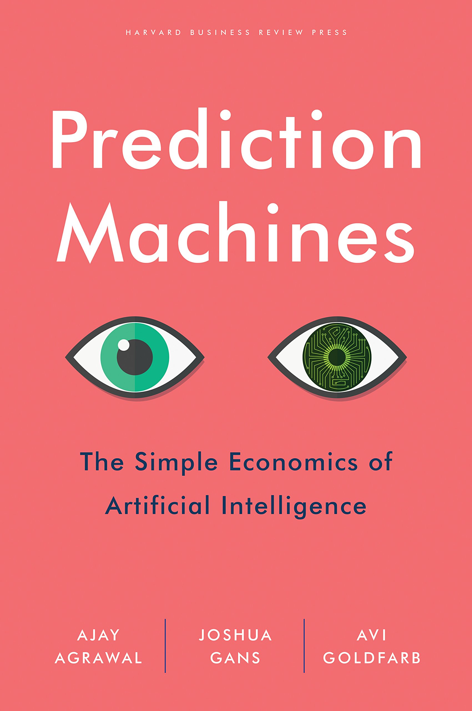

### How do *you* see the *future* of AI ?

- Science Fiction has explored many issues associated with AI. <!-- .element: class="fragment" --> 
  - what happens to individuals, markets, firms, government? <!-- .element: class="fragment" --> 
  - who wins, who looses? <!-- .element: class="fragment" --> 
- Very often economic future is bleak... <!-- .element: class="fragment" --> 
- Why is that so? <!-- .element: class="fragment" --> 

---

# Rise of Artificial Intelligence

## Can we (economists) say more than Science Fiction?

### Pablo Winant

---

## What is AI?

----

### What is AI

- AI can be:
  - a field
  - a set of technologies including
    - machine learning
    - deep learning
    - reinforcement learning
  - a philosophical concept
- <!-- .element: class="fragment" -->Usual definition of AI:
  - mimic human intelligence: 
    - *problem solving*: achieve goal without being explicitly told how
    - *learning*: gets better over time
  - without emotions

----

### How to make the difference between a robot and a ?

- Check whether it thinks like a human being
- Turing test:
  - a machine discussing with a human must be recognized as a 7 years old human 50% of the time
  - can machines emulate human behaviour?
- Chinese Room thought experiment:
  - how to differentiate somebody who speaks chinese and somebody who follows rules to speak?
  - turing test cannot determine whether machines think
- What do you think of these tests?

----

### Impress me?

- So, what can machines do that is really intelligent?
  - speech recognition, language translation
  - drive a car
  - play chess better than a human
  - play go, better than a humman, without being a specialist, by learning on its own
  - [create](https://thispersondoesnotexist.com/), [imagine](http://www.yaronhadad.com/deep-learning-most-amazing-applications/)
  - have [empathy](https://replika.ai/)
  - talk
  
----

### AI effect

- people have a way to discount achievments of AI as "not AI"
  - because not impressive enough
  - because humans do it in "a different way"
- Larry Tesler theorem: "AI is whatever hasn't been done yet"
- Nick Bostrom: "once something becomes useful enough and common enough it's not labeled AI anymore"
- keep human special
  - interestingly that didn't seem to be a concern before the 70s

---

## The Classical View

### "This Time it's Different" or "Same old, same old..."?  

 <!-- .element width="33%" -->
 <!-- .element  width="33%" -->

----
  
###  The (neo)classical production function

What are its main properties?

- production takes several __factors__ as inputs
  - capital
  - labour
  - ... (natural resources, land, ...)
- each factor has a __market price__
- marginal returns w.r.t. each factor are __decreasing__
- factors are paid according to their __marginal productivity__
- the __technology__ is the particular process through which inputs are combined

----

###  AI and the (neo)classical production function

- the precise description depends on the problem under consideration
- what could you change to take into account the effect of AI?
  - data, technological change ? 

----

### Three hypotheses about the economic nature of AI

- A technological change
- A new kind of factor: Data
- Yet another kind of factor: Robots
- Something else Completely

---

## AI is a change in the cost structure

----

<!-- .element width="25%" -->

Ajy Agrawal, Joshua Gans and Avi Goldfarb: *Prediction Machines: The Simple Economics of Artificial Intelligence* 2018

----

### Prediction Machines

- many production tasks can be formulated as __prediction problems__
- exemples:
  - regression, classification: predict Y as a function of X
  - student -> pass or fail ?
  - should I invest in A or B ?
  - even chatbot: what is the appropriate continuation for an ongoing conversation?

----

### Will I loose my job ?
 
- AI is a decrease in the __cost__ of predictions
- The demand for all prediction-intensive tasks will rise (__law of demand__)
- The salary of workers with prediction-intensive tasks will rise (__market price__)
- Value of other tasks will fall (__general equilibrium effect__)
- More precisely:
  - demand for tasks that are __substitute__ to predictions will be low
  - demand for tasks that are __complement__ to predictions will be high

---

## AI is Data

----

<!-- .element width="25%" -->
<!-- .element width="25%" -->

Chad Jones and Christopher Tonetti (Stanford) *Nonrivalry and the Economics of Data* (Sep 2020, American Economic Review)

----

### Data is a factor not a technology

- Data is a __factor__, not a __technology__
  - Can you explain it ?
- The difference between an idea and a factor? Exemples:
  - idea: use machine learning to build self driving cars
  - factor: each car-maker gathering his own data to train cars
- <!---- .element: class="fragment" ---->Data (even anonymous) improves quality of existing products

----

### What kind of good is data ?

- Remember the __classification of goods__? 
  - __nonrival__: can be used with leftovers<!---- .element: class="fragment" ---->
  - __excludable__: use can be limited to paying customers<!---- .element: class="fragment" ---->
  - data is a: __club good__<!---- .element: class="fragment" ---->

- <!---- .element: class="fragment" ----> Nonrivality implies <b>increasing returns to scale</b>
  - marginal value of new data increases more than proportionnally

----

### AI: adds data to the production function (consequences)

- <!---- .element: class="fragment" ---->increasing returns to scale implies <b>natural monopoly</b>
  - ->GAFAMs
  - increasing suboptimal __monopoly rents__ (already a problem before existence of AI...)
  - should you regulate a monopoly?
    - it depends what is the barrier to entry: data-gathering or data-processing
- <!---- .element: class="fragment" ----> other relevant questions
  - where are the markets? (empirically it seems "undertraded")
  - who owns the data ? Consumer, producer.

----

### How do you regulate a Data-monopoly ?

- <!---- .element: class="fragment" ---->solutions:
  - split the monopolies (if deadweight loss is too big)
  - outlaw data gathering (big productivity loss)
  - force data-sharing: make it a public good
  - let the consumer be free to decide whether to rent his data (remove externalitiess)

---

## AI: competition between humans and robots 

----

### Economic singularity

- In the very long run, could technology be __bad__?
- <!---- .element: class="fragment" ----> Recall the neoclassical world
  - market economy
  - technological progress reduces production cost
  - always good for consumers. Increase (real) total income.
  - becomes an inequality problem
- <!---- .element: class="fragment" ----> But
  - whether technology reduces salaries depends on whether growth is __labour augmenting__ or __capital augmenting__
  - if AI is a close enough substitute, salaries of "humans" as a whole are at risk
  - the is an economic *singularity* when salary of humans arrives below the __subsistance level__

----

- Two sets of authors reach very similar conclusions
  - Anton Korinek and Joseph Stiglitz (left): more complete/technical
  - Gilles Saint Paul (right): more __political economy__

----

### Some very long run scenarios

- Analysis taken from Gilles Saint Paul
- <!---- .element: class="fragment" ----> <em>Main hypothesis</em>: all humans can be replaced by more productive robots
- <!---- .element: class="fragment" ----> <strong>Comparative advantage</strong> logic:
  - humans specialize in work where their comparative disadvantage is lowest (services, art, crafting...)

----

### Scenario 1: society redistributes income from robots

Four political subscenarios<!---- .element: class="fragment" ---->

- <!---- .element: class="fragment" ---->welfare state
  - robot-owners are taxed, income is redistributed
   - for instance as universal income
  - <!---- .element: class="fragment" ---->some productivity losses
  - <!---- .element: class="fragment" ---->what about international competitivity?
- <!---- .element: class="fragment" ---->rentiers society
  - robot owners invest the rent over many generations
  - capital concentration increases
- <!---- .element: class="fragment" ---->neo fordism
  - Firms pay huge salaries for essentially useless jobs (powerpoint presentations, 😉 ...)
  - Useful to sustain demand
- <!---- .element: class="fragment" ---->new roman empire
  - robot owners: *patricians* (top 2%)
  - rest of population: *plebeians*
    - survive thanks to clientelism
  - robots: slaves

----

### Scenario 2: wars, starvation, epidemic

</img>

- human income (marginal productivity) falls below subsistance levels
- <!---- .element: class="fragment" ---->malthusian effect: population growth decreases
- <!---- .element: class="fragment" ---->not unheard of (Leontieff): consider population of draft horses

----

### Scenario 3: the Matrix

- human wage decrease
- subsistance level *decrease* dramatically too

<!---- Carbon emissions decreased by 26% during CoVid ---->

---

## Something Else Completely?

- Right now AI is a technology (or a factor)
- <!---- .element: class="fragment" ---->What if it becomes another intelligent agent?
  - has its own goals
  - its own preferences
  - with superhuman thinking abilities...
- <!---- .element: class="fragment" ---->Response in the literature (if curious):
  - Anton Korinek: *if* market economy survives
    - malthusian and non-malthusian scenarios
  - At that stage humans might be something different completely
    - transhumanism

---

## Conclusion

- Research on AI is very speculative: especially about the long run
- But concepts from classical economics still help
- For next time:
  - make sure you understand all concepts in bold

----

## More Readings

- Chad Jones and Christopher Tonetti: *Nonrivalry and the Economics of Data*, American Economic Review

- Avi GoldFarb: *Prediction Machines: The Simple Economics of Artificial Intelligence* 2018

- Gilles Saint Paul: *Robots Vers la fin du travail ?*

- Anton Korinek, Joseph E. Stiglitz: *Artificial Intelligence and Its Implications for Income Distribution and Unemployment*, chapter in *Artificial Intelligence and Its Implications ..., NBER*
  - also on [coursera](https://fr.coursera.org/learn/economics-of-ai)