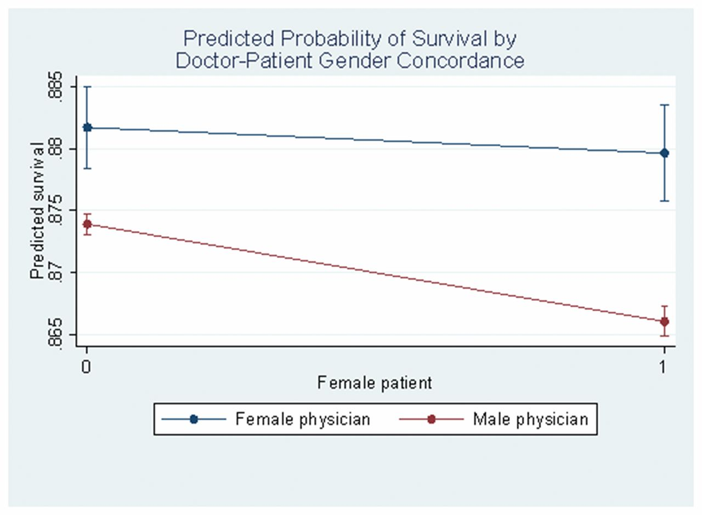
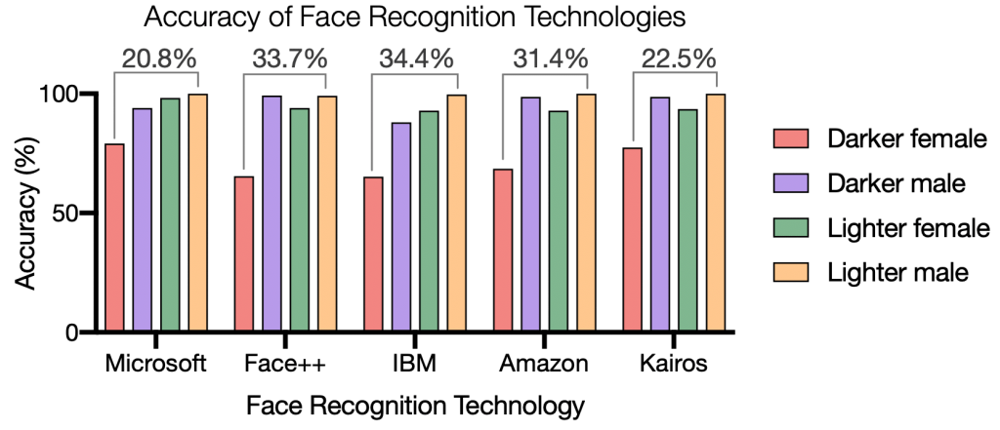

# AI Biases vs Human Biases

### Pablo Winant, ESCP Business School

----

## Intro

[TODO striking example of an AI mistake]

----

## Are you ready to be driven by an AI-driven car?

[two cols: with incremental info][mention software in tesla cars]
1/ Are you ready to be driven by an AI-driven car, 5 years from now?
2/ Info about car accidents.
  - crashes (more crashes )
3/ Info about biases in AI.
  - video
  - incorrect reading of traffic signs

[then there are the matters of responsibility, ethical concerns, etc.]

----

## AIs will take more and more decisions

- AIs will take more and more decisions
  - decide what you'll watch on Netflix
  - drive your car
  - select the recruits you will hire
  - decide whether you should be receiving treatment from the nearby hospital
  - invest your personal finances
  - decide optimal monetary policy of the central bank
- But there will always be a human overseeing these AI decisions?
- ...right?

----

## What is a decision

- Several seemingly different cases:
  - recommendation
  - decision with immediate consequences
  - a part of a decision process
- These cases are not so clearly separable
- Precise agency is not important here
- We'll call of these "decisions"
  - (alternatives: "predictions"/"choices"/...)

----

## Decision Intelligence

- A new emerging field: "Decision Intelligence"
- Defines intelligence as
  - a choice of an "output" from a set of "input"
  - choice is irreversible
- Relates data-science with different fields

----

Example of questions: (from Cassie Kozyrkov, chief decision scientist from Google)

The decision sciences concern themselves with questions like:
- “How should you set up decision criteria and design your metrics?” (All)
- “Is your chosen metric incentive-compatible?” (Economics)
- “What quality should you make this decision at and how much should you pay for perfect information?” (Decision analysis)
- “How do emotions, heuristics, and biases play into decision-making?” (Psychology)
- “How do biological factors like cortisol levels affect decision-making?” (Neuroeconomics)
- “How does changing the presentation of information influence choice behavior?” (Behavioral Economics)
- “How do you optimize your outcomes when making decisions in a group context?” (Experimental Game Theory)
- “How do you balance numerous constraints and multistage objectives in designing the decision context?” (Design)
- “Who will experience the consequences of the decision and how will various groups perceive that experience?” (UX Research)
- “Is the decision objective ethical?” (Philosophy)

----

## Today

We'll consider different ways to analyse AI behaviour from an economic perspective.
In particular, we'll draw parallels, between AI decisions and human decisions

- is AI "stupid"?
- biases from a quantitative/statistical approach
- the problem of preference misspecification
- behavioural mistakes
- homework, talk about your classwork

---

## Quantitative Bias

----

## Definition of Statistical Bias

__Bias__:  systematic error made by a a statistical algorithm producing a prediction

Here, *systematic* means, *in average*. (more precisely, in expectation w.r.t to all the sources of randomness).

----

### Example: WEO forecast

Here is the forecast from the latest World Economic Outlook (IMF)

Is it biased?

----
<!-- 
## Bias vs variance

An algorithm can be always wrong, but not biased. In this case it is said to have high "variance".

In general there is an arbitrage between low bias and low variance.

---- -->

## Sources of biases

- Problems with the data (*data-driven*)
  - __Selection bias__ / attrition biases
  - ...
- Problems with the model (*algorithmic bias*)
  - Ommitted variable bias
  - ...
- Other sources (essentially *human bias*)
  - funding bias
  - social prejudice
  - ...

----

### Image labelling

An AI or you needs to label best describe the following image:

- fruit
- watermelon
- watermelon slices
- juicy
- <!-- .element: class="fragment" data-fragment-index="1" --> red

Obviously, the way the AI (or you) makes category, depends on the dataset it has been exposed to.

- Experience/learning produces a __prototype__ of a watermelon (i.e. an object representative of its class)
- When a __prototype__ is not representative of some data it becomes a __stereotype__
  - it creates __bias__

----

### How do we measure it ?

- Sometimes bias is easy to measure with
  - precise criterium (e.g. no discrimination)
  - precise measure (e.g obvious distribution discrepancies)
- But in general it requires:
  - an experiment
  - some econometric work
- Often, biases are easier to assert for AIs than humans
  - their training occurs in a controlled environment

----

## Example of bias

- Job Market
  - *Job discrimination*: the decision to hire someone at a given salary should not depend on his/her  gender, appearance, social origin, age, ethnicity, ...
  - *Wage gap*: conversely, the wage gap between people with the same overall productivity should be zero, no matter their gender, appearance, ...

- Big problems:
  - how do you measure "same overall productivity"?
  - if you do, how do you find two people with different characteristics and exactly same productivity?
    - given that in general charecteristics and productivity are linked (for instance, name is correlated with IQ)

- One possibility: look at submitted CVs

----

## An example of a failed anti-discrimination policy

- Initial situation: Bob recruits new hires himself
  - he's got prejudice against: single women, obese men, non christian workers, ...
  - he drops unwanted CVs based on:
    - photographs
    - names
- <!-- .element: class="fragment" --> New situation: Bob uses machine learning to select candidates who get an interview
  - task of ML: reject 95% of candidates
  - objective: maximize probability of that selected candidates get the job after their interview
  - diversity requirement: don't use name, gender and photo
- <!-- .element: class="fragment" --> Result: after a few iterations, algorithm selects only young white candidates with christian names

What happened?

Algorithm has learned bias of user, and made it more efficient.

----

### Famous example: Amazon

[Reuters](https://www.reuters.com/article/us-amazon-com-jobs-automation-insight-idUSKCN1MK08G) 11/10/2018: Amazon scraps secret AI recruiting tool that showed bias against women

- What happened?
  - <!-- .element class="fragment"  data-fragment-index="1"--> Amazon started to train (use?) internally a ML algo to preselect CVs and counteract human biases
  - <!-- .element class="fragment"  data-fragment-index="2" --> Algorithm started to discriminate against woman
  - <!-- .element class="fragment"  data-fragment-index="3" --> Sentences containing strings like "women's" were discriminated against (like "champion of women's chess cup")

----

### Example: do you want to be treated by an AI?

[Nature, 25/01/2017](https://www.nature.com/articles/nature21056): Dermatologist-level classification of skin cancer with deep neural networks

- analyze skin images to recognize malignant melanoma
- as good as human dermatologists
  - [TODO] add figures
- more cost-effective (can work on a smartphone)

----

### Example:or do you prefer to be treated by a Hu(man) ? (1)

__Health Services As Credence Goods: A Field Experiment__ (Gootschalk, Mimra, Weibel)

- The same "test patient" was sent to 180 dentists who offered treatment recommendation and cost estimate.
- Test patient did not need treatment (caries lesions limited to enamel).
- 28% of practitioners made a wrong treatment recommendation
- What were the determinants of the bias?
  - Social Economic Status (-)
  - Lower Waiting Time
  
----

### Example:or do you prefer to be treated by a Hu(man) ? (2)

*Perceived Risk of Heart Attack: A Function of Gender?* 2004, (Leanne L Lefler)
- mortality rate for women in the year immediately after suffering a heart attack was 38%, compared to 25% for men
  - woman delay assistance seeking (it's a men problem)?

*Patient–physician gender concordance and increased mortality among female heart attack patients* (Greenwood, Carnahan, Huang)
- higher probability of survival when same-sex doctor
- driven by treatment from male doctors (the majority of cardiologists)

----

### Hungry Judge Effect

...

----

### Conclusions

- AI can reproduce human biases
  - in the way algorithm is designed
  - if it immitates human or if its objective incorporates human bias
- AI's don't have all human biases
  - no hungry judge effect
  - no funding cost (or do they?)
- Humans also suffer from many of the same biases as machines
- Machines have some advantages
  - efficiency

---

## Is AI Stupid?

examples: sees world in different light
lacks context (meta heuristics, ability to disobey)

---

## Preference Mispecifications

----

### What is the right way to describe economic behaviour?

- In economics, we derive agent's behaviour from their ultimate objective
  - maximize profits
  - maximize consumption, leisure
  - something else
- This is very close to the implementation of AI now:
  - ML: miniminize empirical risk (sum of square residuals), maximize the fit
  - AI: robots are explicitely told what to do (not how)
- Biases are precisely defined w.r.t. a well specified goal

----

### Example: Brexit

Here, the objective might not be well specified.

There are unsaid, unconscious, objectives

----

### Example: AI objective misspecification

- famous scifi example
- consumption maximization
- AI objective misspecification

----

### Evolutionary Bias

- Under some circumstances, taking bias decisions can provide a survival advantage
  - treat unknown species as "hostile"
- Limit processing cost

----

### An example of "trimming"

----

### Provide learning advantage

Why do newer movies have better ratings than older ones on movie databases (like Allocine)
And why is the website not doing anything about it?

----

----

### Preferences vs Utility

- Another issue is that humans are not one-dimensional maximizers
- Theories of "Preferences" are larger than utility maximization
  - Among choices $\mathcal{X}$, we say that $x$ is preferred to $y$ if $x \geq y$
- Preferences can be more general than utility maximization
  - ideally transitive if $x \geq y$ and $y \geq z$ then $x \geq z$
  - but there isn't necessarily a total order (complete ranking) $x_1 \geq \cdots \geq x_n$
  - even if there is there is no notion about "how much" $x$ is preferred to $y$
- Generalized Preferences arise naturally from
  - real-world individuals
  - multi-objective agents
  - collective choices (cf Arrow Theorem)

----

### A big limitation

- The problem is when AIs are follow multiple objectives (which they need if they need a notion of context) their bias becomes harder to measure

----

### Example: parcoursup, a ranking algorithm

- The problem: match universities wishes and students wishes
  - while respecting current norms

---

## Behavioral mistakes

---

## Your Project

---

## Final Word

*It's good to follow your own bias as long as it is climbing it.*

Andre Gide