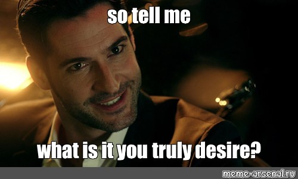
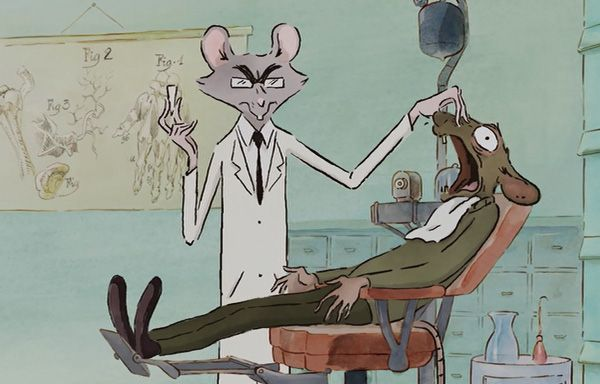
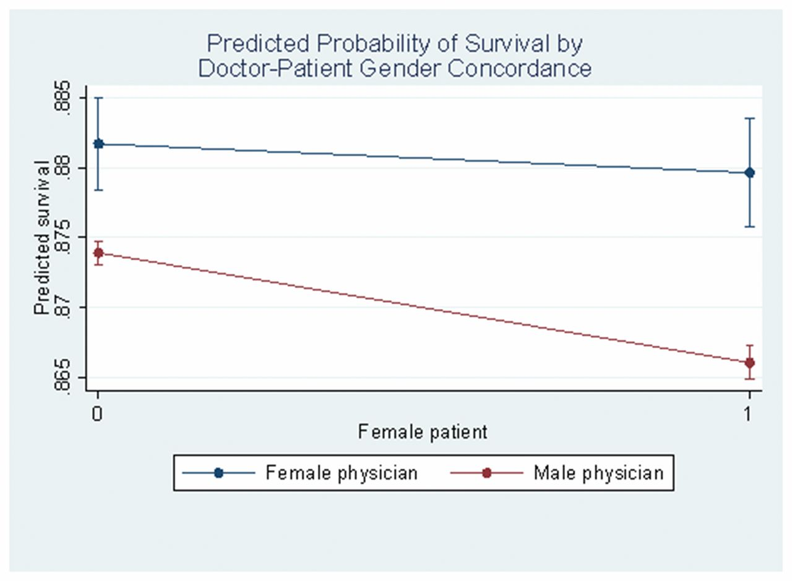
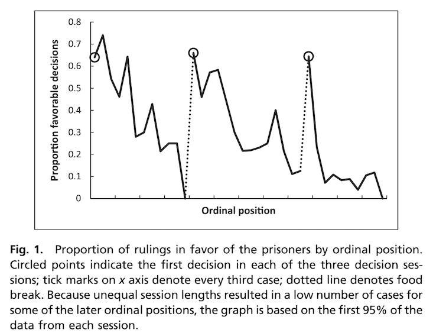
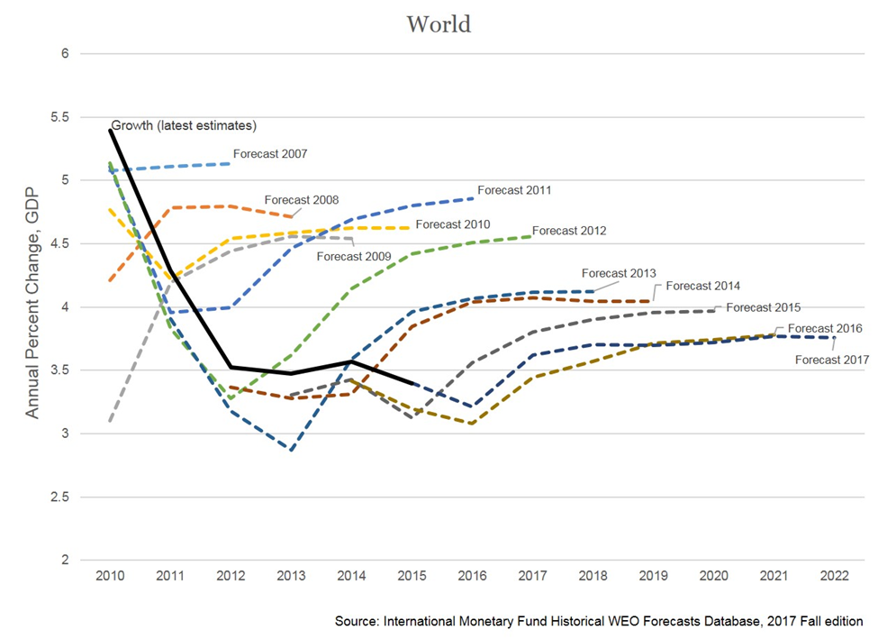
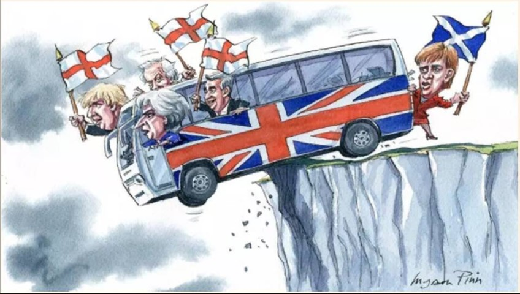
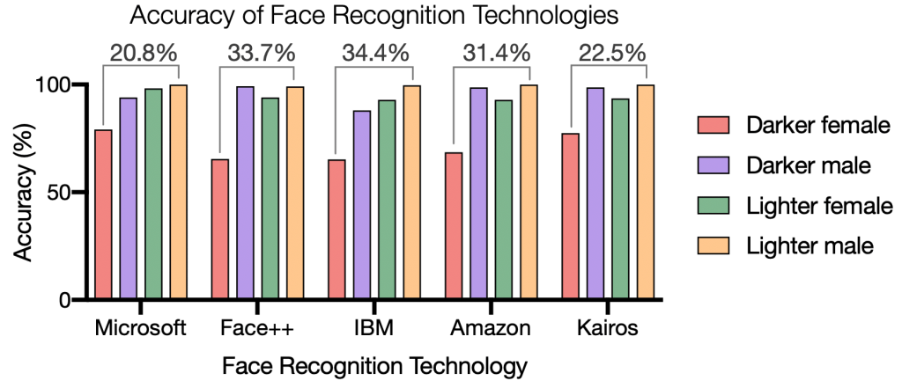

## Warmup

<iframe allowfullscreen frameborder="0" height="100%" mozallowfullscreen style="min-width: 500px; min-height: 355px" src="https://app.wooclap.com/events/KNURPY/questions/63cda97e950988200b23bd80" width="100%" class="stretch"></iframe>

----

<iframe allowfullscreen frameborder="0" height="100%" mozallowfullscreen style="min-width: 500px; min-height: 355px" src="https://app.wooclap.com/events/KNURPY/questions/63cdad518f81e8b5131ed34b" width="100%" class="stretch"></iframe>

----

<iframe allowfullscreen frameborder="0" height="100%" mozallowfullscreen style="min-width: 500px; min-height: 355px" src="https://app.wooclap.com/events/KNURPY/questions/63cdafd7d0c8143c62433886" width="100%" class="stretch"></iframe>

----

<iframe allowfullscreen frameborder="0" height="100%" mozallowfullscreen style="min-width: 500px; min-height: 355px" src="https://app.wooclap.com/events/KNURPY/questions/63cdaffc1a7764faade6ae03" width="100%" class="stretch"></iframe>

----

<iframe allowfullscreen frameborder="0" height="100%" mozallowfullscreen style="min-width: 500px; min-height: 355px" src="https://app.wooclap.com/events/KNURPY/questions/63cdb0268f81e8b5131ed914" width="100%" class="stretch"></iframe>

---

# AI Biases vs Human Biases

### Pablo Winant, ESCP Business School

----

----

## A small question

<iframe allowfullscreen frameborder="0" height="100%" mozallowfullscreen style="min-width: 500px; min-height: 355px" src="https://app.wooclap.com/events/KNURPY/questions/63ce7bfee77a800d2e7a9c50" width="100%" ></iframe> 

- Are you ready to be driven by an AI-driven car, 5 years from now?
- <!-- .element class="fragment" --> Info about car accidents (today)
  - AI: 9 crashes per million mile
  - human: 4 crashes per million mile
  - but almost not majo injury in AI driven cars
- <!-- .element class="fragment" --> AIs are easy to fool
  - incorrect reading of traffic signs with small modifications
  - see [nature]( https://www.nature.com/articles/d41586-019-03013-5)

----

<!-- 
## Is AI Stupid?

examples: sees world in different light
lacks context (meta heuristics, ability to disobey)

--- -->

## AIs will take more and more decisions

- <!-- .element class="fragment" --> AIs will take more and more decisions
  - <!-- .element class="fragment" -->decide what you'll watch on Netflix
  - <!-- .element class="fragment" -->drive your car
  - <!-- .element class="fragment" -->select the recruits you will hire
  - <!-- .element class="fragment" -->decide whether you should be receiving treatment from the nearby hospital
  - <!-- .element class="fragment" -->invest your personal finances
  - <!-- .element class="fragment" -->decide optimal monetary policy of the central bank
- But there will always be a human overseeing these AI decisions?
- ...right?

----

## What is a decision

- Several seemingly different cases:
  - recommendation
  - decision with immediate consequences
  - a part of a decision process
- These cases are not so clearly separable
- Precise agency is not important here
- We'll call  of these "decisions"
  - (alternatives: "predictions"/"choices"/...)

----

Cassie Kozyrkov, chief decision scientist from Google: 

*We define the word “decision” to mean any selection between options by any entity*

----

## Decision Intelligence

- Who studies AI decisions?
- A new emerging field: "Decision Intelligence"
- Defines "decisions" as
  - a choice of an "output" from a set of "input"
  - choice is irreversible
- Relates data-science with different fields

----

<iframe allowfullscreen frameborder="0" height="100%" mozallowfullscreen style="min-width: 500px; min-height: 355px" src="https://app.wooclap.com/events/KNURPY/questions/63cdb4ed10e81389e20790f6" width="100%" class="stretch"></iframe>

----

Example of questions: (from Cassie Kozyrkov, chief decision scientist from Google)

The decision sciences concern themselves with questions like:
- “How should you set up decision criteria and design your metrics?” (All)
- “Is your chosen metric incentive-compatible?” (Economics)
- “What quality should you make this decision at and how much should you pay for perfect information?” (Decision analysis)
- “How do emotions, heuristics, and biases play into decision-making?” (Psychology)
- “How do biological factors like cortisol levels affect decision-making?” (Neuroeconomics)
- “How does changing the presentation of information influence choice behavior?” (Behavioral Economics)
- “How do you optimize your outcomes when making decisions in a group context?” (Experimental Game Theory)
- “How do you balance numerous constraints and multistage objectives in designing the decision context?” (Design)
- “Who will experience the consequences of the decision and how will various groups perceive that experience?” (UX Research)
- “Is the decision objective ethical?” (Philosophy)

----

### The specificities of an economic approach

- Consider different ways to analyse AI behaviour from an economic perspective (*people's decisions*)
  - deviations from rationality
  - specification of a precise objective

----

## Three kinds of bias

- predictive bias
  - ... we know what want but are doing it wrong
- preference bias
  - ...we're wrong about the ultimate objective
- behavioural bias (next week)
  - ...we're doing it wrong

---

## Prediction Bias

----

## Definition of Statistical Bias

__Prediction Bias__:  systematic error made by an algorithm producing a prediction

  - Here, *systematic* must be understood as *in average* or *in expectation*

----

## Sources of prediction biases

- Problems with the data (*data-driven*)
  - __selection bias__ 
  - __attrition bias__
  - ...
- Problems with the model (*algorithmic bias*)
  - __ommitted variable bias__
  - ...
- Other sources (essentially *human bias*)
  - funding bias
  - social prejudice
  - human limitation
  - ...

----

### Image labelling

An AI or you must choose labels to best describe this image:

----

<iframe allowfullscreen frameborder="0" height="100%" mozallowfullscreen style="min-width: 500px; min-height: 355px" src="https://app.wooclap.com/events/KNURPY/questions/63ce4d520cad4779b377e9fe" width="100%"></iframe>

----

### An example of a selection bias

Obviously, the way the AI (or you) makes category, depends on the dataset it has been exposed to.

- Experience/learning produces a __prototype__ of a watermelon (i.e. an object representative of its class)
- When a __prototype__ is not representative of some data it becomes a __stereotype__
  - it creates __bias__

----

### How do we measure it ?

- Sometimes bias is easy to measure with
  - precise criterium (e.g. no discrimination)
  - precise measure (e.g obvious distribution discrepancies)
- But in general it requires:
  - an experiment
  - some econometric work
- Often, biases are easier to assert for AIs than humans
  - their training occurs in a controlled environment

----

### Do you want to be treated by an AI?

[Nature, 25/01/2017](https://www.nature.com/articles/nature21056): Dermatologist-level classification of skin cancer with deep neural networks

- <!-- .element class="fragment"  data-fragment-index="1" -->analyze skin images to recognize malignant melanoma
- <!-- .element class="fragment"  data-fragment-index="2" -->as good as human dermatologists
- <!-- .element class="fragment"  data-fragment-index="3" --> more cost-effective (can work on a smartphone)

----

### Do you (really) want to be treated by an AI?

[The Lancet, 2022](https://www.thelancet.com/journals/landig/article/PIIS2589-7500(21)00252-1/fulltext): *Characteristics of publicly available skin cancer image
datasets: a systematic review*

- They review 21 open access databases, with skin lesion images
  - 106 950 images
  - `Of the two datasets containing data on ethnicity (1585 images in total), 45, 47 no images were from individuals with an African, Afro-Caribbean, or South Asian background`
  - `Coupled with the geographical origins of datasets, there was massive under-representation of skin lesion images from darker skinned populations.`
- Conclusion?

----

### Or do you prefer to be treated by a Hu(man) ? (1)

*Health Services As Credence Goods: A Field Experiment* (Gootschalk, Mimra, Weibel)

- <!-- .element class="fragment" -->The same "test patient" was sent to 180 dentists who offered treatment recommendation and cost estimate.
- <!-- .element class="fragment" -->Test patient did not need treatment (caries lesions limited to enamel).
- <!-- .element class="fragment" -->28% of practitioners made a wrong treatment recommendation! 😲
- <!-- .element class="fragment" -->What were the determinants of the bias?
  - Social Economic Status (-)
  - Lower Waiting Time (+)
  

----

### Or do you prefer to be treated by a Hu(man) ? (2)

*Perceived Risk of Heart Attack: A Function of Gender?* 2004, (Leanne L Lefler)
- mortality rate for women in the year immediately after suffering a heart attack was 38%, compared to 25% for men
  - woman delay assistance seeking (it's a men problem)?

*Patient–physician gender concordance and increased mortality among female heart attack patients* (Greenwood, Carnahan, Huang)
- higher probability of survival when same-sex doctor
- driven by treatment from male doctors (the majority of cardiologists)

----

<iframe allowfullscreen frameborder="0" height="100%" mozallowfullscreen style="min-width: 500px; min-height: 355px" src="https://app.wooclap.com/events/KNURPY/questions/63ce6464ba2b5ba1cc08cff6" width="100%" class="flex"></iframe>

----

## Market bias

- Job Market
  - *Job discrimination*: the decision to hire someone at a given salary should not depend on his/her  gender, appearance, social origin, age, ethnicity, ...
  - *Wage gap*: also the wage gap between people with the same overall productivity should be zero, no matter their gender, appearance, ...
- <!-- .element: class="fragment" -->Big problems:
  - <!-- .element: class="fragment" -->how do you measure "same overall productivity"?
    - wrong measurement leads to __ommitted variable bias__
  - <!-- .element: class="fragment" -->how do you find two people with different characteristics and exactly same productivity?
    - in general many characteristics are linked with productivity  (for instance, name is correlated with IQ)

----

## A not so-fictive example of a failed anti-discrimination policy

- Initial situation: Bob recruits new hires himself
  - he's got prejudice against: single women, obese men, non christian workers, ...
  - he drops unwanted CVs based on:
    - photographs
    - names

-  New situation: Bob uses machine learning to select candidates who get an interview
    - task of ML: reject 95% of candidates
    - objective: maximize probability of that selected candidates get the job after their interview
    - diversity requirement: don't use name, gender and photo

- Result: after a few iterations, algorithm selects only young white, male candidates with christian names

- What happened?
  - Algorithm has learned bias of user
  - Can reproduce it (with less data!)
 

<figure>
  
  <figcaption>Bob from Texas</figcaption>
</figure>

----

### Famous example: Amazon

[Reuters](https://www.reuters.com/article/us-amazon-com-jobs-automation-insight-idUSKCN1MK08G) 11/10/2018: Amazon scraps secret AI recruiting tool that showed bias against women

- What happened?
  - <!-- .element class="fragment"  data-fragment-index="1"--> Amazon started to train (use?) internally a ML algo to preselect CVs and counteract human biases
  - <!-- .element class="fragment"  data-fragment-index="2" --> Algorithm started to discriminate against woman
  - <!-- .element class="fragment"  data-fragment-index="3" --> Sentences containing strings like "women's" were discriminated against (like "champion of women's chess cup")
  - <!-- .element class="fragment"  data-fragment-index="3" --> Program was dismantled

----

### Another human bias

- PNAS 2017, *Extraneous factors in judicial decisions*, Danziger, Levav and Avnaim-Pesso 
  - analyse parole decisions by boards presided by jewish isreali judges
  -  <!-- .element class="fragment"  -->probability of "parole" falls between the two snack breaks! 😱
  -  <!-- .element class="fragment"  -->find a strong "hungry judge effect"

----

### Conclusions

- AI and humans *both* suffer from __selection bias__
- AI can reproduce human biases
  - in the way algorithm is designed
  - if it immitates humans or if its objective incorporates human bias, conscious or not
- AI's don't have all human biases
  - no hungry judge effect
  - no funding cost (or do they?)

<!-- - Humans also suffer from many of the same biases as machines
- Machines have some advantages
  - efficiency -->

----

### Another example: WEO forecast

Here is the history of IMF forecasts (form WEO 2017)

Is it biased?

---

## Preference Misspecification

----

### What is the right way to describe economic behaviour?

- In economics, we derive agent's behaviour from their ultimate objective
  - maximize profits
  - maximize consumption, leisure
  - something else
- This is very close to the implementation of AI now:
  - ML: miniminize empirical risk (sum of square residuals), maximize the fit
  - AI: robots are explicitely told what to do (not how)
- Biases should be precisely defined w.r.t. a well specified goal

----

### Example: Brexit

- Was the collective decision of leaving the UK biased, based on available evidence?
- <!-- .element class="fragment" --> Here, the objective might not be well specified. There are unsaid, unconscious, objectives

----

### Examples: AI objective misspecification

- AI with the wrong objective is evil
- Explored a lot in science-fiction
  - Asimov's law of robotics
  - the smiling man, ...
- Many (all?) "mistakes" from AI come from __preference misspecification__

    

----

### Evolutionary Bias

- It is sometimes optimal to keep a biased decision process in certain situations
- When taking bias decisions provides a survival advantage, it is called an __evolutionary bias__
  - treat unknown species as "hostile"
- <!-- .element class="fragment" -->Rationals
  - Limit processing cost
  - Provide informational value, i.e. help to learn faster
  - ...

----

### An example of "trimming"

- AI algorithm have become very good at recognizing and distinguishing faces...
  - <!-- .element: class="fragment"  data-fragment-index="2" --> ... mostly white men
  - <!-- .element: class="fragment"  data-fragment-index="3" --> selection bias again
- <!-- .element: class="fragment"  data-fragment-index="4" -->Adults have the same biases: they distinguish better faces from their own reference group
- <!-- .element: class="fragment"  data-fragment-index="5" -->Strikingly 6 month old babies don't: they recognize all faces (Netflix: "babies")
- <!-- .element: class="fragment"  data-fragment-index="6" -->The unlearning is called trimming (to save brain resources???)
- <!-- .element: class="fragment"  data-fragment-index="7" -->Same happens with language: initially babies can distinguish all sounds in all languages

----

### An example of learning externality

- Why do newer movies have better ratings than older ones on movie databases (like Allocine)
- <!-- .element: class="fragment"  data-fragment-index="2" -->And why are website not doing anything about it?
- <!-- .element: class="fragment"  data-fragment-index="3" -->New movies are intentionnaly overrated
  - to push consumers towards "exploring"
  - to produce more information
  - and improve the rating of new movies
- <!-- .element: class="fragment"  data-fragment-index="4" -->It can be interpreted as a learning externality

----

### Preferences vs Utility

- Another issue is that *humans are not one-dimensional maximizers*
- Theories of __preferences__ are larger than utility maximization
  - Among choices $\mathcal{X}$, we say that $x$ is preferred to $y$ if $x \geq y$
- Preferences can be more general than utility maximization
  - ideally transitive if $x \geq y$ and $y \geq z$ then $x \geq z$
  - but there isn't necessarily a total order (complete ranking) $x_1 \geq \cdots \geq x_n$
  - even if there is there is no notion about "how much" $x$ is preferred to $y$
- Generalized Preferences arise naturally from
  - real-world individuals
  - multi-objective agents
  - collective choices (cf Arrow Theorem)

----

### Multi-objectives

- Ideal AIs should be multi-objectives:
  - have sensible default for out of sample [situations](https://techcrunch.com/2017/03/17/laying-a-trap-for-self-driving-cars/?guccounter=1&guce_referrer=aHR0cHM6Ly93d3cuZ29vZ2xlLmNvbS8&guce_referrer_sig=AQAAALMqR3R_-o890IYOqB6ZIH6QxlVCnda96sNz--MMiYjzGvm9FaHBZ5Hkey2FmhXzEx26r9wBMfsGpfPO9GFW30E-udtq9GgVqMr4JRrFoTUV5c0-YGdpweHxQADKpycNaenh2KvRfInOD5eVTbuGyaHbGJignO42-iJUZlw8_BpA)
  - produce more intelligent behaviour
  - mitigate wrong objectives given by humans
- The problem is when AIs are trained to follow multiple objectives (which they need if they need a notion of context) their bias become harder to measure/explain

----

### Example: parcoursup, a multi-objective ranking algorithm

- parcoursup match universities wishes and students wishes
  - it aggregate individual's preferences
  - while respecting current laws
- it is a variant of a stable marriage problem
- how do you formulate the optimum?
  - impossible to satisfy everybody
- implementation details makes random decisions
  - in order to avoid bias!
  - and satisfy local regulations
- has created a lot of discontentment

----

### Conclusions

- The concept of predictive bias is contingent to the right, scalar (i.e. a number), objective specification
- Formulating the wrong the objective leads to a prediction bias
- Objectives are inherently hard to formulate exhaustively
- The presence of several objectives complicates the pictures
  - for humans
  - and AIs

---

## Behavioural Biases

----

- ... Next time: 
  - how do we know when humans act non-rationally? 
  - Can we then establish some patterns in their behaviours?

---

## Final Word

*It's good to follow your own bias as long as it is climbing it.*

Andre Gide