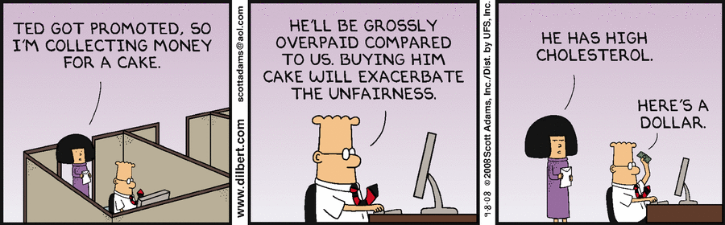
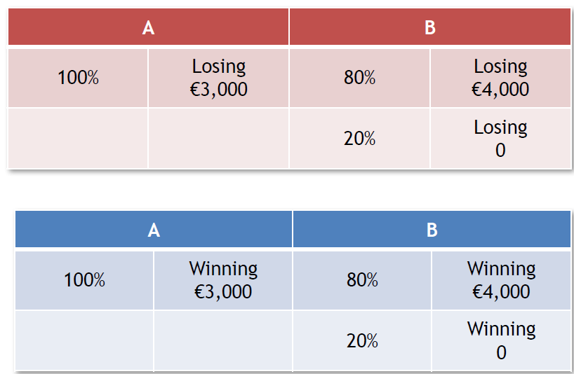
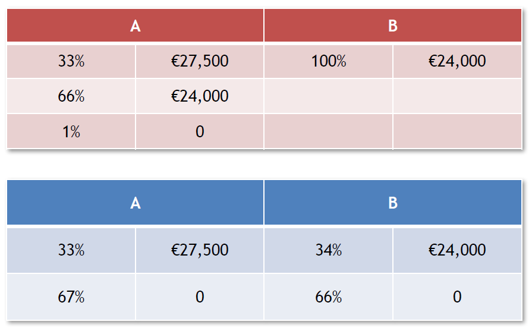
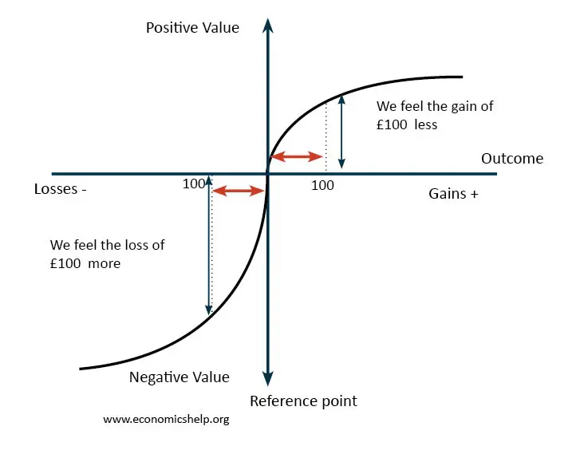
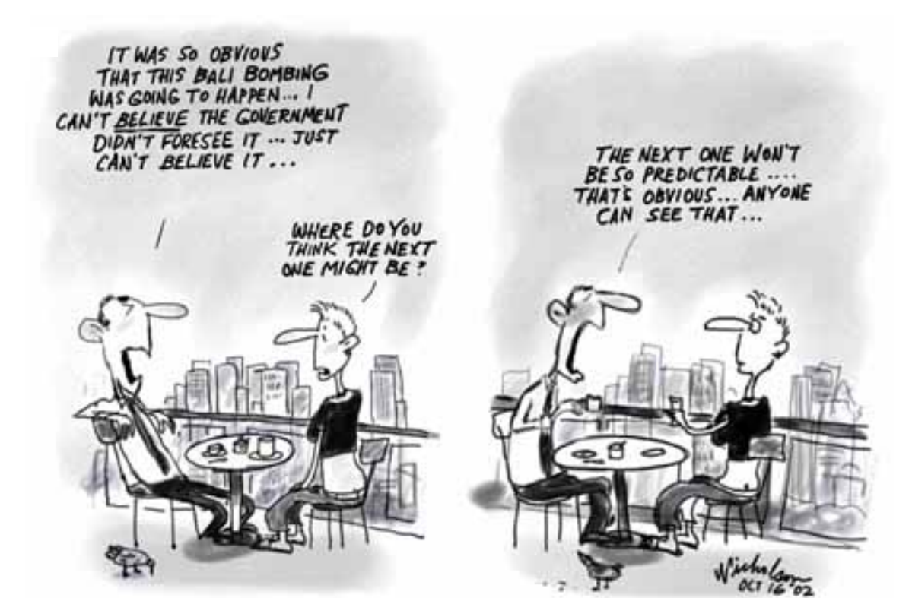
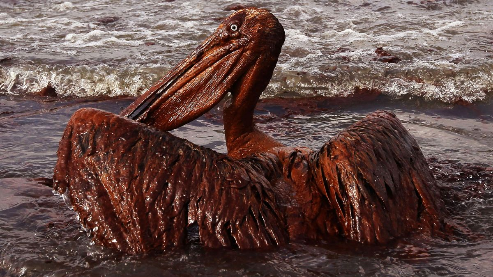

# Quick Intro to Behavioural Economics

### Pablo Winant, ESCP Business School

----

### Behavioural Economics

*Behavioral economics combines elements of economics and psychology to understand how and why people behave the way they do in the real world. It differs from neoclassical economics, which assumes that most people have well-defined preferences and make well-informed, self-interested decisions based on those preferences.* ([intro from university of Chicago](https://news.uchicago.edu/explainer/what-is-behavioral-economics))

----

### Behavioural Economists

 
 

- Behavioural economists:

  - identify *actual* patterns in agent's decisions 
    - they are measured as deviations to idealized, rational, utility-maximizing economic behaviour
  - develop theories that can, consistently predict these patterns
  - patterns and theories are tested empirically in labs

- Good introduction: *Thinking Fast and Slow*

----

### The lab

 

Behavioural economists recruit participants for their experiments.

- they perform some specific tasks or play a specifically designed game
- they are usually paid and incentivized (to have skin in the game)
- experiment tries to recreate conditions so as to expose specific features of human choices
- usually *one* determinant of choice is randomized so as to measure its effect cleanly
- more participants lead to more certain results (if representative)
- nowadays: online labs

----

### The Marshmallow Experiment

#### Instant Gratification

<iframe width="1120" height="630" src="https://www.youtube.com/embed/QX_oy9614HQ" title="YouTube video player" frameborder="0" allow="accelerometer; autoplay; clipboard-write; encrypted-media; gyroscope; picture-in-picture" class="stretch" allowfullscreen></iframe>

----

### On the Replication Crisis

<iframe width="560" height="315" src="https://www.youtube.com/embed/42QuXLucH3Q" title="YouTube video player" frameborder="0" allow="accelerometer; autoplay; clipboard-write; encrypted-media; gyroscope; picture-in-picture; web-share" allowfullscreen></iframe>

---

## Deviations from rationality

----

## The (neo)-classical view

- Agents are perfectly rational...
  - they don't make errors
- ...and pursue their self interest
  - they are selfish

----

### Example: the ultimatum game (1)

- two players negotiate over a fixed amount of money (the pie)
- player 1 demands a proportion of the pie
- player 2 sees the size and player's 1 demand and either rejects or accepts it
  - accept: split is implemented
  - reject: both players get 0

----

### Example: ultimatum game (2)

- hundreds of papers since original one by Guth et al.
- consistent results: average offer is 40%, offers below 20% have high chances to be rejected, lots of 50-50
- note that the "rational choice" for both agents would be 99-1!
- it is an example of __other regarding preferences__ (aka altruism)

----

### Example: ultimatum game (3)

What determines the split? What influences altruism?

Can you devise an exeperiment to measure the effect of "shame"? 

----

### Examaple: ultimatum game (4)

- Measuring the the effect of feeling shame towards the other player
- Protocol
  - for half of the candidates, exactly as before (control sample)
    - control group
  - for the other half, the two players, don't see each other don't have any contact. Only the demand from player one is communicated to player 2.
    - treatment group
- Result
  - -> players are less generous but the result holds

----

### Reflection Effect or Loss Aversion

- Result from literature
  - first lottery: 92% chose B
  - second lottery: 80% chose A
- Intepretation:
  - agents are risk-seekers when it is about loosing money
  - agents are risk-averse when it is about winning money

----

### The Certainty effect / The Allais paradox

- Result from literature
  - first lottery: most people choose A
  - second lottery: most people choose B
- Intepretation: people underweigh outcomes that are merely probable compared to those that are certain

----

### Expected utility

- Expected utility framework
  - simple assumptions on people's preferences
  - agents maximize $U(x)$ where  $U$ is increasing and concave
  - standard in economics and finance
- Concavity implies that agents are risk agents are risk averse

----

### Prospect theory

- Prospect theory was proposed by Kahneman and Tversky in 1979
- Attempts to describe realistically how humans evaluate losses and gains 
- *Prospect* is a close synonym for *gamble*

---

## Other behavioural anomalies

----

### Behavioural anomalies

- We classically distinguish two kinds of behavioural anomalies
  - predisposition towards error
  - mental shortcuts (aka __heuristics__)

- They have been studied by psychologists for a while
- And are being revisited systematically by economists/psychologists
  - ...following the "replication crisis"

----

### Excessive Optimism

- __Definition__: overstimating favourable outcomes

- __Instructions__:
  - You are vice president of product development and are evaluating 8 new product proposals. You have asked two people from R&D (in whom you have equal confidence) to give independent forecasts of the R&D __costs__.

| Project no. | A’s forecast | B’s forecast | Your forecast |
|-------------|--------------|--------------|---------------|
| 1           |  167,000     |    272,000   |               |
| 2           |  274,000     |    783,000   |               |
| 3           |  529,000     |    433,000   |               |
| 4           |  357,000     |    866,000   |               |
| 5           |  146,000     |    659,000   |               |
| 6           |  937,000     |    446,000   |               |
| 7           |  906,000     |    811,000   |               |
| 8           |  483,000     |    379,000   |               |

----

| Project no. | A’s forecast | B’s forecast | Your forecast | Midpoint | Median forecast |
|-------------|--------------|--------------|---------------|----------|-----------------|
| 1           |  167,000     |    272,000   |               | 219,500  | 250,000         |
| 2           |  274,000     |    783,000   |               | 528,500  | 600,000         |
| 3           |  529,000     |    433,000   |               | 481,000  | 500,000         |
| 4           |  357,000     |    866,000   |               | 611,500  | 697,110         |
| 5           |  146,000     |    659,000   |               | 402,500  | 458,850         |
| 6           |  937,000     |    446,000   |               | 691,500  | 788,310         |
| 7           |  906,000     |    811,000   |               | 858,500  | 875,000         |
| 8           |  483,000     |    379,000   |               | 431,000  | 450,000         |

- If A and B’s forecasts are unbiased, your best estimate would be the midpoint
- The median forecast shows the typical response of MBA students with 10 years
of executive experience
- If your forecast is above the midpoint, you are implicitly assuming that R&D
personnel underestimate the costs 
  - that they have "excessive optimism"

----

### Over confidence

- __Definition__: overestimating our own abilities

- Compared to the rest of this group, how would you rate your driving skills?
  - A. Above average
  - B. Below average

- <!-- .element: class="fragment" --> When people in the U.S. were asked this 93% said above average

----

### Hindsight Bias

__Definition__: When people believe an event was more predictable than it actually was.

----

<iframe width="560" height="315" src="https://www.youtube.com/embed/vKA4w2O61Xo" title="YouTube video player" frameborder="0" allow="accelerometer; autoplay; clipboard-write; encrypted-media; gyroscope; picture-in-picture; web-share" allowfullscreen></iframe>

----

### Confirmation Bias

- __Definition__: When you search for or interpret new information in a way that supports existing beliefs as opposed to challenge them.
- Study (Lord, Ross & Leeper, 1979)
  - Setup:
   *48 undergraduates supporting and opposing capital punishment were exposed to 2 purported studies, one seemingly confirming and one seemingly disconfirming their existing beliefs about the deterrent efficacy of the death penalty. As predicted, both proponents and opponents of capital punishment rated those results and procedures that confirmed their own beliefs to be the more convincing and probative ones.*
  - Result: 
  *Participants gave higher ratings to studies that confirmed their initial point of view even when studies on both sides had been carried out by the same method. In the end though everyone had read all the same studies, both those who initially supported the death penalty and those who initially opposed it reported that reading the studies had strengthened their beliefs*.

----

### Attribution Bias

- __Test__:
  - Write down 3 examples of successes that you have had
  - Write down 3 examples of failures
  - <!-- .element: class="fragment" --> What were the causes of the success?
  - <!-- .element: class="fragment" --> What were the causes of the failures?

-  __Definition (attribution bias)__: Overestimating how much control we have over events

- <!-- .element: class="fragment" --> Interpretation:
  - Attribution bias *occurs when people attribute their success to skills, and
  their failures to randomness* (Taleb 2001)
  - It is when we attribute praise/blame to the person rather than the situation.
  *However, successful people can also mistake hard work for luck. Timing can be important but so is developing the skills
  to be able to take opportunities when presented. After all, “the harder you practice, the luckier you get”* Gary Player

----

### Ownership Bias / Endowment Effect

- __Definition__: people place a higher valuation on an asset, purely by owning it
- Example:
  - People are given a mug worth 10$
  - Then the opportunity to exchange it for pens worth 11$
  - Most people don't take the deal
- A striking [example](https://twitter.com/businessinsider/status/1034762586938433536?s=11)
- Do you see other examples? Implications

----

### Representative heuristic

- __Definition__: Judgements based on stereotypes

----

### Availability heuristic

- __Definition__: Judgement based on the ease with which instances come to mind

- __Example__: We tend to think that footballers make more money than dentists, but only because we don't see the failures (there’s a selection bias)
  - Dentistry is a more lucrative profession since it maximises your expected income across all alternative histories
  - *One cannot consider a profession without taking into account the average of the people who enter it, not the sample of those who succeed* Taleb (2001)

----

### Anchoring heuristic

__Definition__: viewing things in relation to an irrelevant comparison point

- Experiment:
  -  <!-- .element: class="fragment" -->Show a number: e.g. 10
  -  <!-- .element: class="fragment" -->What percentage of members of the United Nations are countries in Africa
- Result
  -  <!-- .element: class="fragment" -->People who saw a 10 had an average guess of 25%
  -  <!-- .element: class="fragment" -->People who saw a 65 had an average guess of 45%
-  <!-- .element: class="fragment" -->Correct answer: 28%. There are 54 African countries (including Western Sahara), and 192 UN member states

----

How oil spills harm birds, dolphins, sea lions and other wildlife

----

### Affect heuristic

- __Definition__: Over-reliance on our immediate emotional reaction

- Example:
  - <!-- .element: class="fragment" -->Following the Exxon Valdez oil spill, people were asked how much they were willing to pay for equipment that would do the following:
    - Save 2,000 birds:  $80 
    - Save 20,000 birds:    $78 
    - Save 200,000 birds:   $88 
  - <!-- .element: class="fragment" -->The almost complete neglect of quantity in such emotional contexts has been confirmed many times

---

### Reflect and Recollect

Try to name three different kinds of behavioural biases/heuristics

For each one give an original example.

----

### Mini-homework

- Groups C.X: prepare two MCQs about today's course

- All groups:
  - find a prompt to test whether GPT-3 / ChatGPT features one of those behavioural biases
  - send the result as one single pdf page including: the prompt, the response, your interpretation
