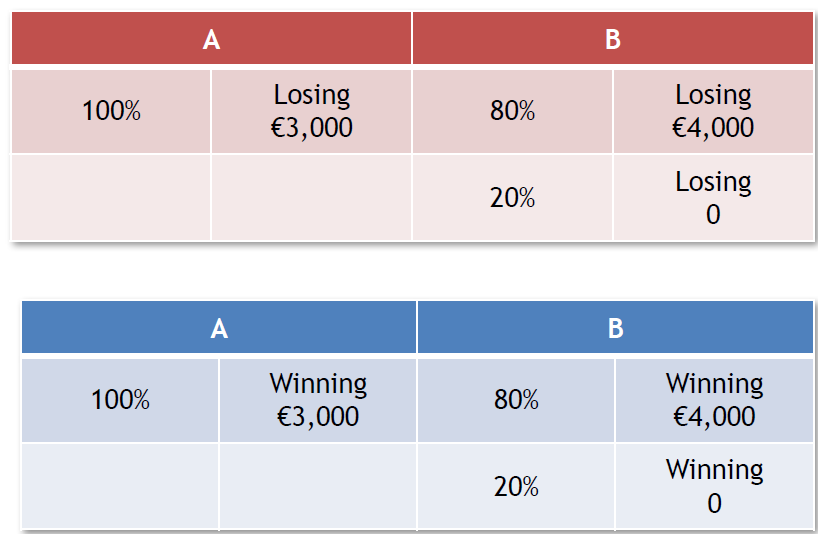

# AI & Behavioural Biases (quick intro)

### Pablo Winant, ESCP Business School


<style>
.container{
    display: flex;
}
.col{
    flex: 1;
}
</style>

----

### Overview


In [session 2](./session_2/../index.html), we have discussed several kinds of biases that apply to AI:
- biases from a quantitative/statistical approach
  - systematically wrong predictions of well-defined prediction algorithm
- the problem of preference misspecification
  - algorithm is correct, but the goal it must achieve is wrong
  - preference specification is subject to many problems (multiple contingencies, preference aggregation, multiple objectives)
- AI "behavioral" mistakes
  - AI replicates non rational human behavior (behavioural biases)
  - can be by immitation or otherwise

----

### Behavioural Economics

```Behavioral economics combines elements of economics and psychology to understand how and why people behave the way they do in the real world. It differs from neoclassical economics, which assumes that most people have well-defined preferences and make well-informed, self-interested decisions based on those preferences.``` ([intro from university of Chicago](https://news.uchicago.edu/explainer/what-is-behavioral-economics))

Behavioural economists:
- identify *actual* patterns in agent's decisions 
  - they are measured as deviations to idealized, rational, utility-maximizing economic behaviour
- develop theories that can, consistently predict these patterns
- patterns and theories are tested empirically in labs

----

### The Marshmallow Experiment

#### Instant Gratification

<iframe width="1120" height="630" src="https://www.youtube.com/embed/QX_oy9614HQ" title="YouTube video player" frameborder="0" allow="accelerometer; autoplay; clipboard-write; encrypted-media; gyroscope; picture-in-picture" allowfullscreen></iframe>

----

### The lab

 

Behavioural economists recruit participants for their experiments.

- they perform some specific tasks or play a specifically designed game
- they are usually paid and incentivized (to have skin in the game)
- experiment tries to recreate conditions so as to expose specific features of human choices
- usually *one* determinant of choice is randomized so as to measure its effect cleanly
- more participants lead to more certain results (if representative)

----

### Example: Other-regarding preferences

The ultimatum game:
- two players negotiate over a fixed amount of money
- player 1 demands a proportion of the pie
- player 2 sees the size and player's 1 demand and either rejects or accepts it
  - accept: split is implemented
  - reject: both players get 0

----

### Example: Other-regarding preferences (2)


- hundreds of papers since original one by Guth et al.
- consistent results: average offer is 40%, offers below 20% have high chances to be rejected, lots of 50-50
- note that the "rational choice" for both agents would be 99-1!

----

### Example: Other-regarding preferences (3)

What determines the split? What influences altruism?


There are many variants of the ultimatum game with small variations.
- Example: what is the effect of feeling shame towards the other player
  - for half of the candidates, exactly as before (control sample)
    - control group
  - for the other half, the two players, don't see each other don't have any contact. Only the demand from player one is communicated to player 2.
    - treatment group
  - -> players are less generous but the result holds

----

### GPT-3

- GPT-3: Generative Pre-trained Transformer
  - by OpenAI (now Microsoft
  - big deep-learning architecture, trained billions of texts
- produces completion on a prompt
  - the prompt can be used to explain the context...
  - ... but might influence the response
- can we use GPT-3 as our participant in the lab?
  - with which procedure? what would be the experimental biases?
- can we replicate experimental designs to test for behavioural biases?
- what does it even mean?

----

### GPT-3: example


----

### The Behavioural AI Project

- Next week: a game jam
  - several short starting ideas will be presented
  - choose one, work individually on it, then in group, present ideas
  - by the end of the session fill a very short project description
  - then one week to substantiate it a bit (not necessarily finish it)
- The Behavioural AI project
  - we want to know what is the behavior of AI, what are its biases
  - think about an experimental protocol, or a game-design, which exposes it
  - present it as if it was an actual project
 - For next time, look for resources on behavioural biases
  - *Thinking Fast and Slow* by Daniel Kahneman is the best but there are many good youtube videos (ex: veritasium)

---

## Example of Behavioural Biases


----

### The Reflection effect, or Loss aversion



----

### The Certainty effect / The Allais paradox


----

### Behavioural anomalies - Two Categories

- predisposition towards error
- mental shortcuts

We are interested in both

----

### Excessive Optimism

- __Definition__: overstimating favourable outcomes

- __Instructions__:
  - You are vice president of product development and are evaluating 8 new product proposals. You have asked two people from R&D (in whom you have equal confidence) to give independent forecasts of the R&D costs.

----


### Over confidence

- __Definition__: overestimating our own abilities

- Compared to the rest of this group, how would you rate your driving skills?
  - A. Above average
  - B. Below average

- <!-- .element: class="fragment" --> When people in the U.S. were asked this 93% said above average

----

### Hindsight Bias

__Definition__: When people believe an event was more predictable than it actually was.


----

### Confirmation Bias

- __Definition__: When you search for or interpret new information in a way that supports existing beliefs as opposed to challenge them.
- Study (Lord, Ross & Leeper, 1979)
  - ```48 undergraduates supporting and opposing capital punishment were exposed to 2 purported studies, one seemingly confirming and one seemingly disconfirming their existing beliefs about the deterrent efficacy of the death penalty. As predicted, both proponents and opponents of capital punishment rated those results and procedures that confirmed their own beliefs to be the more convincing and probative ones```
  -  ```Participants gave higher ratings to studies that confirmed their initial point of view even when studies on both sides had been carried out by the same methods in the end though everyone had read all the same studies, both those who initially supported the death penalty and those who initially opposed it reported that reading he studies had strengthened their beliefs``` 

----

### Attribution Bias

- __Definition__: Overestimating how much control we have over events

- __Test__:
  - Write down 3 examples of successes that you have had
  - Write down 3 examples of failures
  - <!-- .element: class="fragment" --> What were the causes of the success?
  - <!-- .element: class="fragment" --> What were the causes of the failures?

- <!-- .element: class="fragment" --> Interpretation:
  - Attribution bias “occurs when people attribute their success to skills, and
  their failures to randomness” (Taleb 2001)
  - It’s when we attribute praise/blame to the person rather than the situation
  However, successful people can also mistake hard work for luck. Timing can be important but so is developing the skills
  to be able to take opportunities when presented. After all, “the harder you practice, the luckier you get” Gary Player

----

### Representative heuristic

- __Definition__: Judgments based on stereotypes


----

### Availability heuristic

- __Definition__: Judgment based on the ease with which instances come to mind

- __Example__: We tend to think that footballers make more money than dentists, but only because we don't see the failures (there’s a selection bias)
  - Dentistry is a more lucrative profession since it maximises your expected income across all alternative histories
  - “One cannot consider a profession without taking into account the average of the people who enter it, not the sample of those who succeed” Taleb (2001)

----

### Anchoring heuristic

__Definition__: viewing things in relation to an irrelevant comparison point

- Experiment:
  -  <!-- .element: class="fragment" -->What percentage of members of the United Nations are
  countries in Africa
  -  <!-- .element: class="fragment" -->People who saw a 10 had an average guess of 25%
  -  <!-- .element: class="fragment" -->People who saw a 65 had an average guess of 45%
-  <!-- .element: class="fragment" -->Correct answer: 28%. There are 54 African countries (including Western Sahara), and 192 UN member states

----

### Affect heuristic

- __Definition__: Over-reliance on our immediate emotional reaction

- Example:
  - <!-- .element: class="fragment" -->Following the Exxon Valdez oil spill, people were asked how much they were willing to pay for equipment that would do the following:
    - Save 2,000 birds: $80
    - Save 20,000 birds:  $78
    - Save 200,000 birds $88
  - The almost complete neglect of quantity in such emotional contexts has been confirmed many times

