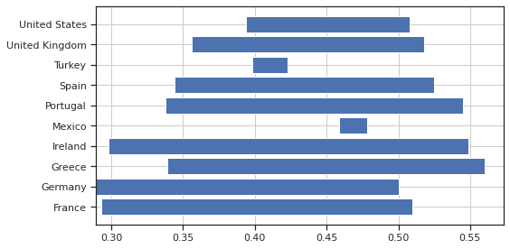

\tableofcontents

# Measurement of Inequality

## GDP

\begin{overprint}

\only<1>{
\includegraphics[width=0.6\textwidth]{inequalities_1.png}
}

\only<2>{
\includegraphics[width=0.6\textwidth]{inequalities_2.png}
}

\end{overprint}

\vspace{-1cm}

\only<1>{
\begin{itemize}
\item GDP is equal to total income
\item Does not say anything about distribution
\item But data is available
\end{itemize}
}

\only<2>{
\begin{itemize}
\item Sort people by income levels make groups of equal sizes.
\item These are called \emph{percentiles}.
\item Take average per quantile.
\end{itemize}
}

\note{Here there are 3 percentiles.}

---

## Income Inequality

\begin{overprint}

    \begin{center}
\only<1>{
\includegraphics[width=0.6\textwidth]{income_inequality_1.png}
}

\only<2>{
    \includegraphics[width=0.6\textwidth]{income_inequality_3.png}
}

\only<3>{
    \includegraphics[width=0.6\textwidth]{gini.png}
}

\only<4>{
    \includegraphics[width=0.6\textwidth]{income_inequality_comparison.png}
}

\end{center}

\vspace{-0.5cm}

\end{overprint}

\only<1>{
\small
\begin{itemize}
\item Here are the results for France with 10 quantiles (deciles)
\item AFter tax montly available income per adult in 2011:
    \begin{itemize}
    \item bottom 10 decile: 522 dollars in average
    \item top 10 decile: 4226 dollars in average
    \end{itemize}
\item Ratio top 10 / bottom 10: 8
\end{itemize}

}

\only<2>{

\begin{itemize}
\item Cumulative, normalized (sum to 1), income
    \begin{itemize}
    \item Lorenz curve
    \end{itemize}
\end{itemize}

}

\only<3>{

\begin{itemize}
\item Lorenz curve represnent distribution inequality
\item Gini index: A/(A+B)
    \begin{itemize}
    \item Gini=0: perfect equality
    \item Gini=1: extreme inequality
    \end{itemize}
\end{itemize}

}

\only<4>{

\begin{itemize}
\item Example of International Comparison
    \begin{itemize}
    \item France and UK have similar level of inequality
    \item United States: more inequal country
    \item China and Brazil: high inequality
    \end{itemize}
\end{itemize}

}

---

## How did it evolve over time?

\begin{center}
\includegraphics[width=0.6\textwidth]{gini_evolution.png}
\end{center}
\vspace{-0.5cm}
\small
\begin{itemize}
\item France
    \begin{itemize}
    \item Constant decrease in the 70s, 80s
    \item Increased inequalities in the late 90s, 20s
    \item Decrease/Stability since
    \end{itemize}
\item United States
    \begin{itemize}
    \item Comparable to France in 70s
    \item Constant increase in the 70s, 80s, 90s
    \item Relatively constant since
    \end{itemize}
\end{itemize}

---

# Other Dimensions of Inequality

## Other Dimensions of Inequality (measure)

- Measure:
  - pre-tax income
  - after-tax income
  - consumption
  - wealth

- Population
  - generational gap
  - gender gap
  - racial gap

---

## Pre-tax vs post-tax inequality

\note{
    gini index for various countries, before and after taxes: 2014
    \begin{itemize}
    \item compare France and United states: similar inequality in income before taxes 51
    \item redistribution in France brings it back to  0.29, vs 0.39 in the US
    \item european countries tend to redistribute more
    \item small european countries (Ireland, Portugal, Greece) have high pre-tax levels of inequalities
    \end{itemize}
}

---

## Consumption Inequality

Consumption inequality much lower than income inequality.

\begin{itemize}
\item<1-> Two main reasons
\begin{itemize}
\item<2-> consumption sharing within a household, or a family
\item<3-> consumption smoothing over time through borrowing
    \begin{itemize}
    \item<4-> transitory shocks
    \item<5-> life-cycle smoothing
    \end{itemize}
\end{itemize}
\end{itemize}

\note{
    Consumption inequality tends to be much lower than income inequality.
\begin{itemize}
\item Two main reasons
\begin{itemize}
\item consumption sharing within a household, or a family
\item consumption smoothing over time through borrowing
\end{itemize}
\end{itemize}
}

---

## Other Dimensions of Inequality (population)

- Racial gap
  
- Gender gap
    - EU: women get paid in average 15\% less than men. 10\% less for same work.
  
- Generational inequality (France)
    - baby-boomers had rising income profiles and high pensions
    - new generations have flatter income profiles and (expected) lower pensions

\note{
    - US: in average whites earn 30\% more than blacks, who earn 20\% more than hispanics.
    - Not just racism. Job occupation. Educational disparities. Geographic segregation. Plenty of other factors. 
    - European commision: women earn on average 15% less than men. France is close to European average. Around 10\%
    - generational ineq : even more true for wealth inequality:
 }

---

## Can we bear inequality ?

- Yes if:
  - it is associated with higher economic efficiency (??)
  - the economic cost of reducing inequality is important (??)
  - it is associated with high social mobility (???)
- No if: reducing inequality is an objective per se

---

## Takeways

- Basic inequality measure: quantile ratios, gini coefficient

- Several dimensions of inequality

\note{Let you think about how much you care.}
