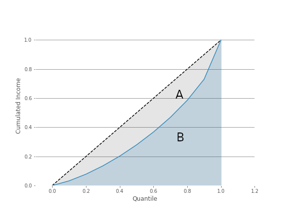
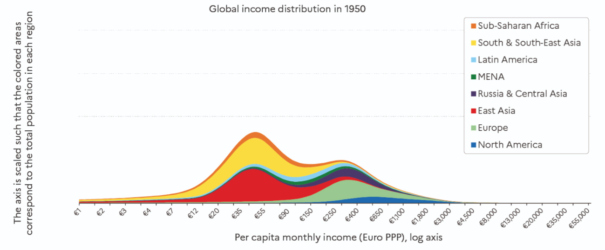
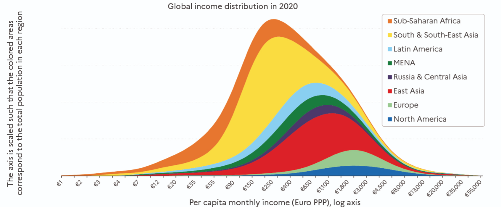
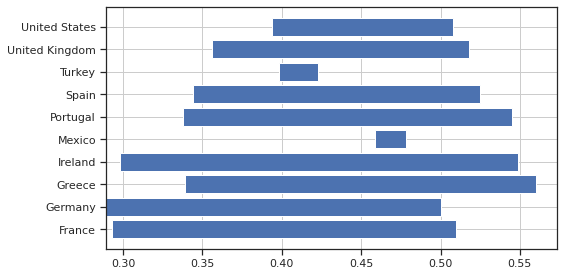

# Inequalities

### Pablo Winant, ESCP Business School

----

### GDP

- GDP = *Total* Revenue
  - a proxy for well-being
- But GDP says nothing about distribution
- Though there is data about it...

- Sort agents by revenue levels, in equal groups
- Those groups are called __quantiles__
- Take the average per quantile

----

## Income Inequality

Here is the result for France with 10 quantiles (deciles)
- After-tax revnenu for France in 2011:
  - lower decile (bbottom 10): 522 dollars/month in average
  - higher decile (top 10): 4226 dollars/month in average
- Ratio top 10 / bottom 10: 8
  - ratios between quantile neutralize average revenue allowing for international comparisons

- *Lorenz Curve*
    - Cumulative Distribution, Normalized (sums to 1) of income

- The Lorenz curve shows graphically the deviation of the destribution from an equal benchmark
- Gini Index: A/(A+B)
    - Gini=0: perfect equality
    - Gini=1: perfect inequality
- Remark: there is a formula for the Gini index, as a function of cumulative quantiles ($X_k$) and cumulative revenues ($Y_k$) $$G=1-\sum_{k=0}^{n-1}(X_{k+1}-X_k)(Y_{k+1}+Y_k)$$

A first international comparison:
- France and UK have (today) similar levels of inequality
- United States:  a more unequal country
- China and Brasil: very unequal

----

More gini indices:

which do you think are the most unequal countries?

https://www.statista.com/statistics/264627/ranking-of-the-20-countries-with-the-biggest-inequality-in-income-distribution/

---

# The big picture

----

Quiz: do you think inequalities are rising?

----

## Source

- Where to find historical Data about inequality ?
- The best source: [World Inequality Database](https://wid.world/)
  - Thomas Piketty
  - Lucas Chancel
  - Emmanuel Saez
  - Gabriel Zucman
  - ...
- A team of *very* serious researchers behind [World Inequality Lab]()

----

----

----

----

[REWRITE]Global inequality rose between 1820 and 1910, and stabilized at a high level since then
No difference between 1910 and now, except increase in middle 40%

level of inequality that we currently observe in the most unequal countries in the world, such as South Africa, Brazil, Mexico and the United Arab Emirates (see Chapter 1). In brief: in terms of inequality and concentration of resources and economic power, the world today is and has long been like a giant South Africa.

Over the long run inequality has decreased

----

- Between-country: assume everybody in the country has the same income
- Within-country: averages between countries, weighted by country sizes

For both series: same level in 1920 as in 2020

----

----

  
  
  
  
  

Evolution of the between dimension

----

Shall we focus also on the super rich?

----

Income of the 1% and 0.1% top earners was highest in 1910 then decreased until all time low in the 60s and rose again, but not as high.

----

> Our new series reveal that, around the turn of the 21st century, the within- country component of global inequality has become greater than the between-country component.
> In contemporary capitalism, an individual’s income group (i.e. whether they belong to the bottom 50%, top 1%, etc. in their own country) now matters more than their nationality (where they live) in the determination of global inequality levels.

---

# Beyond Income

----

What kind of inequality do we care about?

----

## Measures

- income (net of taxes)
- income (gross)
- consumption
- wealth
- chance of being unemployed
- health
- life-expectancy
- well-being
- carbon emissions
- decision power
- beauty
- environmental exposition
- provision of public goods

----

Should we focus on income?

----

### Net vs Gross Inequalities

    
- Gini index for several countries before and after taxes in 2014
    -   <!-- .element: class="fragment" -->France and United states: same pretax inequality level: 0.51
    -   <!-- .element: class="fragment" -->In France, redistribution brings it to 0.29,0.39 aux US
    -   <!-- .element: class="fragment" -->European countries tend to redistribute more
    -   <!-- .element: class="fragment" -->some small european countries (Ireland, Portugal, Greece) have similar, very high levels of inequalities

----

----

### Consumption Inequality

From <u>Measuring and Comparing Consumption Inequality between France and the United States</u>, Aliocha Accardo, Sylvérie Herbert, Cristina Jude, Adrian Penalver

----

### Consumption Inequality

- Consumption Inequality is much lower than income inequality
-  <!-- .element: class="fragment" -->Two main reasons
   - <!-- .element: class="fragment" --> Consumption sharing within a household or a family
   -  <!-- .element: class="fragment" -->Consumption smoothing with borrowing or saving
      - to absorb temporary shocks
      - to smooth consumption over the life cycle

----

### Life-Cycle

----

### Wealth Inequality

----

### Wealth Inequality

----

### Wealth Inequality

- What is the problem with Wealth Inequality?
  - it is very persistent
  - it is still an instrument of power (less so than in the past)
- Since richer individuals get access to higher returns on investment, by itself, wealth inequality tends to intensify
- Most economic models find that wealth is not automatically mean-reverting

----

## Inequality Dimensions

For a given welfare target, one gets different inequality measures.

- by changing the overall population. *Within*
  - country
  - region
  - peers, ...
- by comparing several subcategories. *Between*
  - countries
  - race
  - gender
  - age or generation?
  - education level

----

### Reference group

We have seen already how the reference group affects inequality measure

----

### Intra-population

-  <!-- .element: class="fragment" -->Racial gap
    - <!-- .element: class="fragment" -->in the US, whites earn 30% more than afro-americans who earn 20% more than hispanics
    - <!-- .element: class="fragment" -->not just about racism
      - different job types
      - differences in education
      - geographic segregation
      - ...
-  <!-- .element: class="fragment" -->Gender gap
    - EU: women receive in average 15\% less than men
    - They earn 10\% for equivalent work (European Commision).  
- In both cases, one must distinguish a pure measure of inequality from a measure of discrimination.

----

### Inter-Generational Inequality

-  <!-- .element: class="fragment" -->Age gap (France)
   -  baby-boomers saw their income rise during their life and enjoy rather high pensions
   -  new generations have lower life-income profiles and lower expected pensions
   -  even more problematic for wealth inequality: average age for retirement is 60 years

---

## Why do you care?

----

> What improves the circumstances of the greater part can never be regarded as an inconveniency to the whole. No society can surely be flourishing and happy, of which the far greater part of the members are poor and miserable.

Adam Smith, <u>The Wealth Of Nations</u>, Book I Chapter VIII, p.96

----

----

### Political Philosophy (1)

__Utilitarianism__: the state should maximize total utility of all citizens(Bentham, Stuart Mill)

- <!-- .element: class="fragment" -->marginal utility implies the need for some distribution (because rich citizens derive less utility from an additional consumption unit than the poors)
- <!-- .element: class="fragment" -->it does not imply perfect redistribution because
  - there is a cost to redistribution
  - too much equality can induce bad incentives which is detrimental to everybody

- <!-- .element: class="fragment" -->Moden version: Pareto weights $\omega_i$
    $$\max \sum_i \omega_i U(c_i)$$

----

### Political Philosophy (2)

- __Liberalism__: the state should choose fair policies as evaluated by an objective observer hidden behind a *veil of ignorance*

- <!-- .element: class="fragment" -->John Rawls proposes a mental experiment where one evaluates the rules of the society (including the economic system) from an original posiiton untainted by the ultimate place of the observer in the society
- <!-- .element: class="fragment" -->reducing inequalities could be seen as insurance against a bad draw
- <!-- .element: class="fragment" -->but what is the risk? when probabilities are unknown one talks about ambiguity, or radical uncertainty
- <!-- .element: class="fragment" -->it is not clear what is the aversion to this kind of risk
  - <!-- .element: class="fragment" -->Rawls/Knight: one maximizes utility in the worth case (<b>maximin creterion</b>)
- <!-- .element: class="fragment" -->more redistribution than in the <em>utilitarian</em> case
  - but not 100% equal either

----

### Political Philosophy (3)

__Libertarianism__: state should punish crimes, and  help secure voluntary contracts between willing individuals, but it should not redistribute income
- inequality is not relevant at a state's level
  - in the same way that granting the same grade to all students is not a valid objective
- it doesn't mean libertarians are not altruistic
- state must guarantee that the allocation procedure be legal
  - concretely: grant property rights

----

Among the three philosophies, what do you think is the better description of international relations between countries?

----

### Preferences

We have seen last week, how regular human beings can have "other-regarding" preferences
- cf the ultimatum game

A key concept here is the notion of "reference group"

There are different kinds of "other-regarding" preferences

----

### Reference group

----

### Other regarding preferences

----

### Other regarding preferences are not only about money?

- Do you find it scandalous?
- What if big carbon emitters were paying for it?

----

## Classical Efficiency Argument

Adam Smith view (according to Debora Boucoyannis)
- individuals should be paid according to their marginal productivity
  - i.e. what they bring to the society
  - more productive individuals should be paid more to produce more
- but because marginal returns are decreasing no one will get very high salary
  - not even entrepreneurs because profits are decreasing

⇒ High inequality is a sign that markets are not functioning properly

----

> Of the tendencies that are harmful to sound economics, the most seductive, and in my opinion the most poisonous, is to focus on questions of distribution... The potential for improving the lives of poor people by finding different ways of distributing current production is nothing compared to the apparently limitless potential of increasing production.

Bob Lucas (2004)

----

## Inequality and Development

Kusnetz has studied the relationship between the level of development and inequality.

He asserted that countries develop in two phases:
- in developing economies: entrepreneurs accumulate wealth by hiring cheap workers migrating from the country-side to the cities
- in mature economies: salaries rise and growth in human capital becomes central to economic growth

----

## Inequality and Growth (1)

What if there was trade-off between growth and inequality:

- __trickle-down economics__:
  - transferring money to the riches benefits everyone because it is reinvested in the economy
  - popular with some conservative politicians
  - ...but not defended by any serious economist
- some growth economists (Paul Romer, Philippe Aghion) have studied how growth induces more inequality
  - through skill-biased technical changes
  - through the unequal of the rents from innovation

----

## Inequality and Growth (2)

Empirically, several studies have been carried out see whether there was a systematic relationship between growth of inequalities.

Empirical literature: effect of inequality on growth
- Deininger and Squire 1998, Barro 2000, Forbes 2000, ...:
inconclusive
- Banerjee and Duflo 2003: inverted U-shape

----

Response to Lucas

>It’s fairly common for conservative economists to try and shout down any discussion of income distribution by claiming that distribution is a trivial matter compared with the huge gains from economic growth. For example, Robert Lucas:
  > Of the tendencies that are harmful to sound economics, the most seductive, and in my opinion the most poisonous, is to focus on questions of distribution.

> The usual answer to this is to point out that we don’t actually know much about how to produce rapid economic growth — conservatives may think they know (low taxes and all that), but there is no evidence to back up their certainty. And on the other hand, we know how to make a big difference to income distribution, especially how to reduce extreme poverty. So why not work on what we know, as at least part of our economic strategy?

----

## Modern version: Mankiw's defense of the top 1%

- Greg Mankiw:
  - New Keynesian
  - conservative
  - author of the (very consensual) textbook "Principles of Economics"
    > Most economists today belong to the classical school of thought.
- Splash: [Defending the One Percent](https://www.aeaweb.org/articles?id=10.1257/jep.27.3.21) in Journal of Economic Perspectives, 2013
- [Krugman Response](https://archive.nytimes.com/krugman.blogs.nytimes.com/2013/06/22/greg-mankiw-and-the-gatsby-curve/)

----

## Ideas: 

read piketty's column

why is inequality a big problem when facing big challenges?

---

## Main challenges

----

---

References:

- Piketty and Chancel, <u>Global inequality 1820-2020: The Persistence and Mutation of Extreme Inequality</u>, Journal of the European Economic Association, 2021
- [World Inequality report, Chapter 2](https://wir2022.wid.world/chapter-2/).