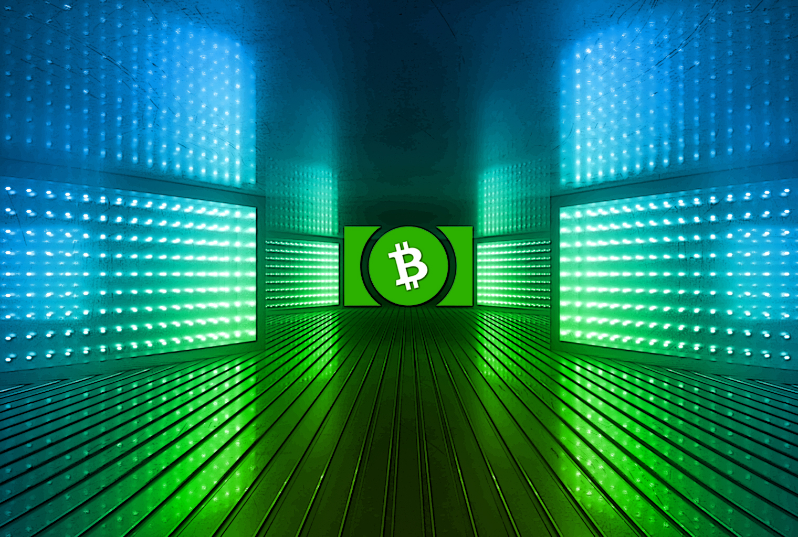
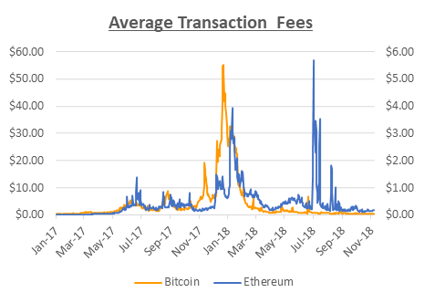
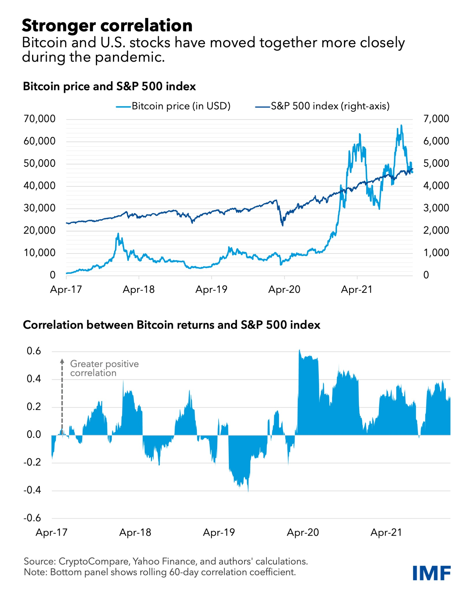
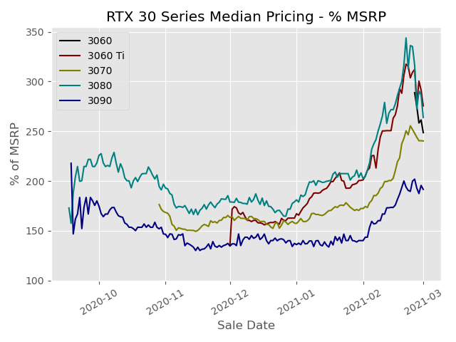
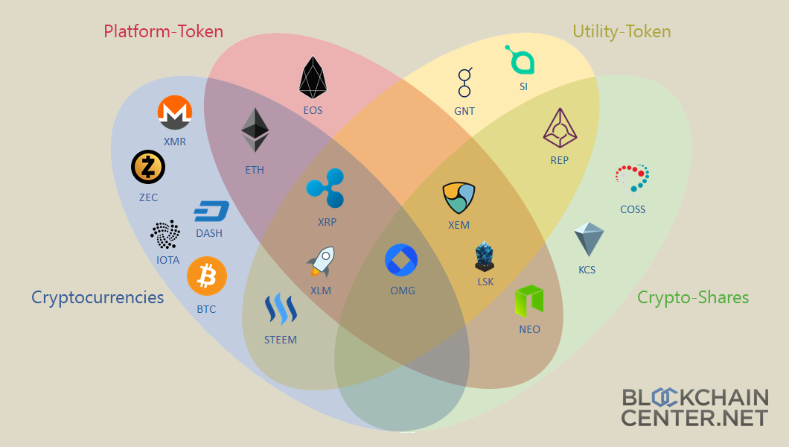
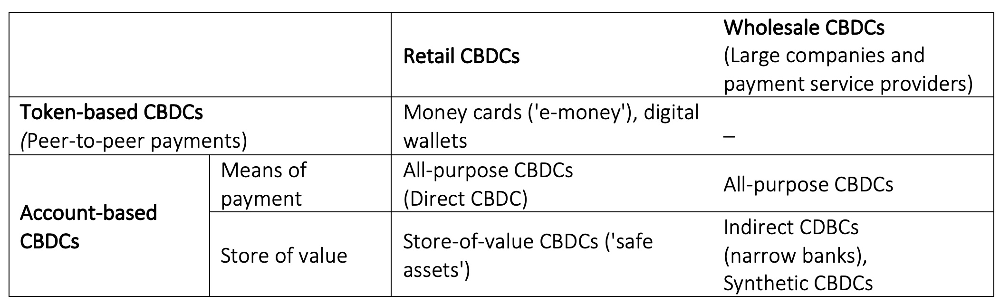

# Central Banks, Cryptocurrencies, Digital Currencies

### Pablo Winant, ESCP Business School

----

### What's happening

- Bitcoins / stablecoins
- Cryptos & Digital Currencies
- Blockchain & Defi
- NFT's
- Smart Contracts

----

### What can the CB do?

- Watch
- Regulate
  - forbid
  - adapt laws
  - organize
- Create its own technology
  - Central Bank Digital Currency
- Main problem: landscape changes very fast
  - technologies and market forces are not clearly understood
  

----

### Today

- review the main evolutions of the crypto-sphere
- call an expert about the ways to regulate cryptocurrencies
  - Mark Le Page from Ernst & Young
- discuss the challenges raised by central bank digital currencies

---

## Bitcoin

----

### Is Bitcoin Money?

The traditional functions of money are:
- a medium of exchange
- a store of value
- a unit of account

How do they apply to Bitcoin?

----

### Is Bitcoin a Medium of Exchange?

It is now possible to buy some goods with Bitcoins (Tesla, Walmart, Some Coffee Shops)

But look at the transaction fees...
And the transaction delays: >10 min

----

## Is it a unit of Account?

Not yet.

----

## Is Bitcoin a Store of Value?

- Is it safe?
  - Bitcoin price is 12 times more volatile than Eur/usd
  - Gold is 2 times more volatile than Eur/usd
- Maybe it is uncorrelated to other assets?
  - No it is not, it amplifies volatility of other assets.
- Maybe bitcoin has higher returns?
  - indeed it has had, but it might not be structural
- Overall, it doesn't look like a store of value or if it is, it's a risky one...

----

## Is Money Money?

Bitcoin is definitely not a traditional currency. Some economists prefer to call Bitcoin a crypto-asset. 

Maybe the "traditional functions" of money might not be so useful categories. Think about whether *cash* satisfies the criteria
- a medium of exchange
  - but is cash a good medium of exchange (have you taken the taxi recently?)
- a store of value
  - right now, inflation is 5% in the Eurozone
- a unit of account
  - is that so important for smartphone assisted humans?

Imho, these definitions are perfectly adequate for economic anthropology: they explain best how we came out of the barter economy.

Nowadays, there is a continuum between assets and money (e.g. quasi-money, money-market funds, ...) and the narrow definition of money is less useful.

----

## Why is Bitcoin so valued then?

- Its decentralized nature makes it independent from individual currencies
  - easy international transactions
- It is independent from states and banks
  - a dream for libertarians
  - a way to escape totalitarian states
- An ounce of technophilia
- The fact that other investors value it
  - that's pretty much the definition of a bubble
  - but bitcoin is actually used as underlying assets for other cryptos (which have faster and cheaper transaction costs)

----

## The blockchain

- Blockchain is also called "distributed ledger"
- It keeps a record of all transactions between each "node"
  - this record is unfakable and unmutable
- Who keeps this record?
  - special participants called miners
- The system is based on cryptographic principles which allow to certify operations

----

## The Miners

How does it work?

- The distributed ledger
  - Transactions are recorded in blocks, linked to each other
  - The full blockchain is stored on all nodes (currently 324GB!)
  - Any node can explore the blockchain to check that a transaction between A and B has taken place
  - Transaction can be verified by looking up in the history
- Miners
  - New blocks containing new transactions are added by miners
  - Miners essentially maintain the blockchain
  - They charge a fee to create new transactions
  - And are incentivized by some probability of mining a new bitcoin (currently 6.25 per block)
  - This process requires hard computational work. It is required to keep the currency supply limited.

----

### The cost of transactions

We have seen that performing a bitcoin transaction is expensive (between 1.78$! and 62$ !)
- Note that this is a market equilibrum:
  - users can choose their fee
  - their waiting time depends on the willingness of miners to record the transaction
- Somehow the price of transactions measures the value of the transaction motive

----

### The cost of transactions (2)

A whole industry has evolved to mine bitcoins

----

### From the Bitcoin to a Banking System

- Since transactions can't easily be done by individuals users use custodial Wallets
- A custodial Wallet is a notional account provided by an intermediary
  - it represents ownership of some bitcoins
- When transactions are made between several wallet users
  - no actual bitcoin payment is made
  - only the notional values by the intermediary are changed
- When transactions involve several firms, only net flows need to be executed
- Wait, that sounds a lot like a bank!

----

### Other cryptocurrencies

---

## DeFi

----

## Generalisation of the Blockchain

- A system that can record and authenticate transactions can be used to perform many other things than currency
  - instead of currency, interest bearing instrument
- Currency, debt instruments are fungible tokens (no difference between one bitcoin and another)
- But blockchains are increasingly being used to exchange non fungible tokens.
  - An NFT is a property title on a unique asset.
  - diamond, digital key, immmaterial goods (Sorare, )
- Then this title can be resold and it is possible to find out who owns it.
- Note that the conversion of the title into an actual object/service is still the responsibility of the issuer.
  - it works best in the virtual world

----

## Smart Contracts

- Relying on computational power to implement the blockchain allows for more advanced operations.
- Some platforms permit the execution of programs on the blockchain.
  - these are called smart contracts
- Most famous smart contract platform is Ethereum
- It makes it possible to perform operations (not only property checks)
- There is an incentive scheme to compensate for the needed computations with Ethereum currency (Ether)   

----

## Smart Contracts (2)

- For example, an issuer A can create a token with the guarantee he will pay x% to the owner of the token every month
  - this is a debt contract!
  - with a natural secondary market (debt can be resold)
- Program can be more complicated: it can pay an amount that is linked to inflation or exchange rate
  - it becomes a derivative product!

----

## Smart Contracts (2)

Warren Buffett: derivatives are "financial weapons of mass destruction."

Derivatives have created a very complex interdependent market which collapsed in 2008.

Imagine the same with automatic execution algorithms on Ethereum...

----

## Smart Contracts (3)

There is a difference though:
- for traditionnal assets, guarantees are given by contracts (and law)
- for a smart contract, it is by algorithm design
  - in that sense, it permits the creation of crypto-assets that are safe, by design
  - ... as long as everything remains on the blockchain (collateral, margin calls, etc...)

----

## Stable Coins

- __Stable coins__ are special crypto assets whose price vs the dollar remain fairly stable.
- They are especially useful to convert returns in crypto currencies to real currencies
- How do you control the value of a currency? Two possibilities:
  - intervene on the market by selling / buying the currency
  - change the circulating amount of currency ...
  - or its intrinsic value  (debase, reevalue)
    - (fix the conversion rate of the stablecoin with another crypto asset)
- All are famous practices of central banks!
  - FX Markets: use foreign exchange reserves to stabilize market
  - control inflation by issuing more money
  - debasement with old metal currencies / banknotes redenomination

----

### Remark

-  The weak point is always the link to the real economy:
  - conversion to dollars
  - data suppliers
  - real goods supply
- These points of contact are still governed by real world contracts and trust
- The more contracts happen on the blockchain, the more trustable the system is...
- ...as long as you trust the blockchain!

---

## Central Bank Digital Currency

----

### Why do the Central Bank want to create their own digital currency?

- Most Central Banks (80%) are investigating the feasibility of emitting their own Digital Currency (CBDC)
  - sometimes based on a distributed ledger (blockchain)
  - but mostly without (CB becomes central certificate provider)
- Main reasons:
  - it would replace crypto-currencies and reduce their systemic risk
  - it would reduce the number of fraudulent operations and increase tax revenues
  - it would ease the implementation of monetary policies more efficient
- Major unkonwn:
  - it is not clear what form it would take: token, account
  - who would have access
  - the impact of CBDC's on the economy/financial market is still unknown

----

### Several kinds of CBDC

CB plans evolve around many different scenarios.

In all cases, the digital currency would have legal tender.

----

### Several kinds of CBDC: token based or account based

[Digital euro](https://www.ecb.europa.eu/paym/digital_euro/html/index.en.html): "accessible to everyone"

- Token CBDC is a new equivalent of cash.
  - it can be used for exchange
  - stored anywhere (for instance a wallet, a website, ...)
  - it respects privacy better (of owners, not of transactions)  
- Account CBDC basically replaces deposits
  - individuals/entities have an account at the central bank
  - payments consists in transferring money from one account to another

----

### Privacy and Tax Revenues

- Transactions can be verified using "Zero-knowledge proof" algorithms.
- It is theoretically possible to build the system in a way such that individuals can share their personal data only when needed.
  - to other individuals
  - to the central bank
  - to fiscal authorities
  - to the judiciary authorities
- In particular it is possible to make illegal income and transactions, taxable

----

### Would CBDC  replace crypto-currencies?

By design a CBDC would outperform all cryptocurrencies on all functions of money:
- transaction costs: would be essentially free and instant
  - essentially, the costs of transacting would be subsididized as a kind of public service
- accounting unit: because it would have legal tender
- store of value: as long as the central bank has a good reputation
  - note that the situation might be different in emerging countries

----

### Would CBDC  replace crypto-currencies?

One could still see some advantages in using cryptos instead
- one could use inflation-immune or interest bearing cash
- perform international transactions more easily
- better anonymity

Some of these advantages could be obtained with a blockchain on top of the CBDC

----

### Implementation of monetary policies

As we have already noted, using a digital currency would make it easier for the central bank to conduct monetary policy:

- it could perform implement helicopter drops easily in a non distortionary way
  - just increase the amount on all bank accounts at the Central Bank
- if CBDC is bearing an interest it could change it as a way to direcly influence consumption/savings incentives

----

### What would the financial sector become?

- If you can have a bank account at the CB, or a wallet with digital currency, why would you open a current account and make deposits?
  - current accounts charge high fees, transfers are sometimes slow, etc.
- There is little doubt bank accounts as we know them would disappear...
- retail banking activities would be split into several services
  - lending
  - insurance
  - ...

----

### What would the financial sector become?

- ... and with it the current model of commercial banks which take short term deposits to invest in longer term projects would disappear
- Then these projects would have to be
  - financed by the CB or
  - financed through equity and investment bank
- Without current accounts, commercial banks wouldn't be able to create money and current system of fractional reserves system would need to be revisited
  - *money creation* would become again a monopoly of the central bank

----

### What would the financial sector become?

- So far, the experiments made by the CB and BIS, have pledged to "do no-harm" (to the financial sector)
- But once everybody uses the digital asset, nobody wants the cash and deposits anymore

----

