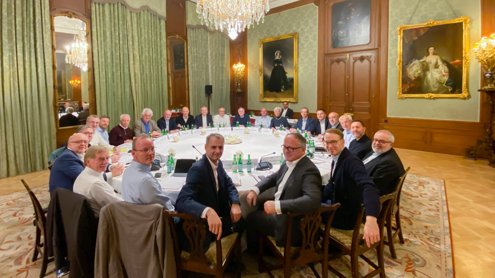

# Central Banks, Cryptocurrencies, Digital Currencies

### Pablo Winant, ESCP Business School

----

## What's happening

- Bitcoins / stablecoins
- Cryptos & Digital Currencies
- Blockchain & Defi
- NFT's
- Smart Contracts

----

## What can the CB do?

- Watch
- Regulate
  - forbid
  - adapt laws
  - organize
- Create its own technology
  - Central Bank Digital Currency
- Main problem: landscape changes very fast
  - technologies and market forces are not clearly understood
  

----

## Today

- review the main evolutions of the crypto-sphere
- call an expert about the ways to regulate cryptocurrencies
  - Mark Le Page from Ernst & Young
- discuss the challenges raised by central bank digital currencies

---

# Bitcoins

## Is Bitcoin Money?

The traditional functions of money are:
- a medium of exchange
- a store of value
- a unit of account

How do they apply to Bitcoin?

----

## Is Bitcoin a Medium of Exchange?

[photo coffee]

It is now possible to buy some goods with Bitcoins (Tesla, Walmart, Some Coffee Shops)

But look at the transaction costs...
And the transaction delays: >10 min

----

## Is it a unit of Account?

[photo coffee]

It is now possible to buy some goods with Bitcoins (Tesla, Walmart, Some Coffee Shops)

But look at the transaction costs...
And the transaction delays: >10 min

----

## Is Bitcoin a Store of Value?

- Is it safe?
  - Bitcoin price is 12 times more volatile than Eur/usd
  - Gold is 2 times more volatile than Eur/usd
- Maybe it is uncorrelated to other assets?
  - No it is not, it amplifies volatility of other assets.
- Maybe bitcoin has higher returns?
  - indeed it has had, but it might not be structural
- Overall, it doesn't look like a store of value or if it is, it's a risky one...

----

## Is Money Money?

Bitcoin is definitely not a traditional currency. Some economists prefer to call Bitcoin a crypto-asset. 

Maybe traditional functions of money might not be so useful. Think about whether cash satisfies the criteria
- a medium of exchange
  - but is cash a good medium of exchange (have you taken the taxi recently?)
- a store of value
  - right now, inflation is 5% in the Eurozone
- a unit of account
  - is that so important for smartphone assisted humans ?

Imho, these definitions are perfectly adequate for economic anthropology: they explain best how we came out of the barter economy.

Nowadays, there is a continuum between assets and money (e.g. quasi-money, money-market funds, ...) and the narrow definition of money is less useful.

----

## Why is Bitcoin so valued then?

- Its decentralized nature makes it independent from individual currencies
  - easy international transactions
- It is independent from states and banks
  - a dream for libertarians
- An ounce of technophilia
- The fact that other investors value it
  - that's pretty much the definition of a bubble
  - but bitcoin is actually used as underlying assets for other cryptos (with faster and cheaper transaction costs)

----

## The blockchain

Since many years, banks have become very excited about the blockchain

Blockchain is also called "distributed ledger"

It keeps a record of all transactions between each "node"
- this record is unfakable and unmutable

Who keeps this record?
- special participants called miners

The system is based on cryptographic principles

----

## The Miners

How does it work?

...not a chance

----

## The Miners

How does it work?

- The distributed ledger
  - Transactions are recorded in blocks, linked to each other
  - The full blockchain is stored on all nodes (currently 324GB!)
  - Any node can explore the blockchain to check that a transaction between A and B has taken place
  - Transaction can be verified by querying other nodes
- Miners
  - New blocks with new transactions are added by miners
  - Miners essentially maintain the blockchain
  - They charge a fee to create new transactions
  - And are incentivized by some probability of mining a new bitcoin (currently 6.25 per block)
  - This process requires hard computational work. This is required to keep the currency supply limited.

----

### The cost of transactions

We have seen that performing a bitcoin transaction directly is expensive (between 1.78! and 62$ !)
- It is interesting to note that this is a market equilibrum:
  - users can choose their fee
  - their waiting time depends on the willingness of miners to record the transaction
- Somehow this measures the value of the transaction motive

----

### The cost of transactions (2)

- A whole industry has evolved to mine bitcoins
  - [TODO]: give some statistics

----

### From the Bitcoin to a Banking System

- Since transactions can't be done by individuals easily users use custodial Wallets
- A custodial Wallet is a notional account provided by an intermediary
  - it represents ownership of some bitcoins
- When transactions are made between several wallet users
  - no actualy bitcoin payment is made
  - only the notional values by the intermediary are changed
- When transactions involve several firms, only net flows need to be executed
- Wait, that sounds a lot like a bank !

----

### Other cryptocurrencies

---

## DeFi

----

## Generalisation of the Blockchain

[TODO]: improve explanation

A system that can record and authenticate transactions can be used to perform many other things than currency
- instead of currency, interest bearing instrument

Currency, debt instruments are fungible tokens (no difference between one bitcoin and another)

But blockchains are increasingly being used to exchange non fungible tokens.
An NFT, is a property title on a unique asset.
- TODO: diamond, digital key

Then this title can be resold and it is possible to find out who owns its.

Note that the conversion of the title into an actual object/service is still the responsibility of the issuer.
- it works best in the real world

----

### Cf worthless paper

....

Strangely enough, the possibility to certify ownership and authenticity has been there in a while.
It can be implemented with a central authority.

----

## Smart Contracts

---

## Central Bank Digital Currency

[photo coffee]

---

### Appendix

----

---

## Can there be several currencies?

parallel money
usual consensus: no
  - after european integration
  - after german integration (didn't keep ostmark)

in Greece:
  quasi-money can be created by the government: IOU
  cryptocurrency (proposed by Ianis Varoufakis)
in California 2009
in France: assignat
Cuba, dual system

micro-currencies:
  in France, Basque region (Eusko). Overall 60 micro-currencies

trade currencies

----
Gresham's law